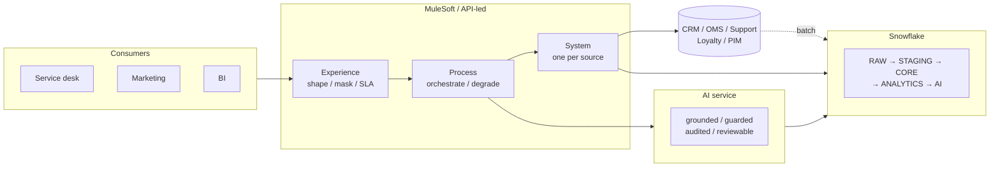

# Enterprise Data & AI Integration Platform

**MuleSoft + Snowflake + AI-powered Customer Intelligence: architecture and proof of concept**

[](https://github.com/raghubavaraju/enterprise-data-ai-integration-platform/actions/workflows/ci.yml)
[](mule/)
[](snowflake/)

> **This repository is an independent architecture and proof-of-concept project
> designed to demonstrate enterprise Data, Integration and AI architecture
> capabilities. It is not intended to represent production experience with any
> particular organisation.** Nothing here has been deployed. Every performance
> and availability figure is a stated architectural assumption, not a
> measurement. [What this does *not* do](#limitations) is part of the deliverable.

---

## Why I built this

Most of my work has been on the integration side: MuleSoft, API-led design, the
usual argument about where a transformation belongs. The interesting problems
lately sit one layer over, where the integration platform, the warehouse and now
an AI capability all have to be designed together instead of bolted onto each
other afterwards.

I wanted one worked example of that rather than three separate demos, so I picked
a customer-intelligence use case, built the whole path, and wrote down the
decisions I made and the ones I rejected. The Customer 360 and the churn scoring
came first; the AI layer came last, on purpose, because it is the part that only
works if the governance underneath it is already right.

It runs on a laptop. That constraint did more for the design than anything else,
because anything that cannot be executed cannot be checked.

## The business problem

**Acme Retail Corporation** (fictional) holds customer data in seven systems,
CRM, e-commerce, ERP, order management, customer support, loyalty and the product
catalogue. Twelve applications need combinations of them.

Three consequences, and each one is an architectural requirement:

1. **Nobody can answer a whole-customer question.** "Is this customer worth
   retaining?" needs order value, service history and loyalty standing at once.
   Today an analyst assembles it by hand, differently each time.
2. **Every new consumer is a new integration.** Seven sources × twelve consumers
   is up to 84 point-to-point connections, 84 places a schema change can break
   something, and 84 places an entitlement decision is made differently.
3. **AI cannot be introduced safely.** There is no governed, PII-controlled,
   point-in-time view for a model to read. Pointing an LLM at the CRM would give
   it the blast radius of an unaudited admin account.

## The solution



| Layer | What it does | Detail |
|---|---|---|
| **Integration** | API-led connectivity in three layers, so replacing a source system changes **one application** | [architecture.md](docs/architecture.md), [ADR-001](docs/decisions/ADR-001-api-led-connectivity.md) |
| **Data** | Six-schema Snowflake platform; materialised Customer 360 where every derived metric is explainable in one sentence | [data-architecture.md](docs/data-architecture.md), [ADR-002](docs/decisions/ADR-002-snowflake-data-platform.md) |
| **AI** | A separate service reading a PII-free, point-in-time view, with **no path to any source system** | [ai-architecture.md](docs/ai-architecture.md), [ADR-004](docs/decisions/ADR-004-ai-separated-from-integration.md) |

---

## Running it

**No cloud account, no licence, no API key.**

```bash
git clone <repo> && cd enterprise-data-ai-integration-platform
make setup     # python dependencies
make build     # build the local warehouse from the sample dataset
make run       # start the platform (or `make up` for docker compose)
make smoke     # end-to-end demonstration
make test      # 245 tests, including the AI evaluation gate
```

`make build` says exactly what it ran and what it skipped:

```
[3/6] Transformations
  OK    06-transformations/01-raw-to-staging-customer.sql  (2 statements)
  OK    06-transformations/04-staging-to-core-scd2.sql     (18 statements)
  SKIP  05-pipelines/03-incremental-scd2-merge.sql
        Snowflake-only: MERGE (not available in DuckDB 1.1)
[5/6] Data quality
  RUN   22 rules -> {'PASS': 14, 'WARN': 5, 'FAIL': 3}
```

Ten processes start: three API-led layers, the Snowflake SQL API, the AI service
and five mock source systems. See [diagram 09](diagrams/09-deployment-topology.md).

### What `make smoke` shows you

```
1. OAuth 2.0 client credentials
2. Customer 360 through the full API-led chain
     name / e-mail    Sofia C*** / s*********@example.com   <- masked: no pii:read scope
     churn            MEDIUM p=0.3988 top driver DECLINING_ORDER_TREND
     sources          CRM,OMS,SUPPORT,LOYALTY,ENGAGEMENT completeness 100%
3. Correlation id propagates end to end                     PASS
4. Grounded AI insights                        (with citations and review status)
5. Least privilege - a read-only client cannot invoke the AI PASS ×4
6. Error contract                                            PASS
7. Idempotency - a replayed AI call is not charged twice      replay=True
8. Data quality scorecard (planted defects are expected)     3 FAIL, 5 WARN
9. High-risk cohort ordered by customer value
```

---

## Try the API

```bash
TOKEN=$(curl -s -X POST localhost:8080/oauth/token \
  -d "grant_type=client_credentials&client_id=acme-portal-client\
&client_secret=change-me-local-only&scope=customer:read insights:read ai:invoke" \
  | jq -r .access_token)

# Unified customer view, experience → process → system → SQL API → warehouse
curl -s -H "Authorization: Bearer $TOKEN" -H "x-correlation-id: demo-1" \
  "localhost:8080/api/v1/customers/CRM-100005/360?orderLimit=2" | jq
```

```jsonc
{
  "customerId": "CRM-100005",
  "profile": {
    "fullName": "Sofia C***",                    // masked: this client has no pii:read
    "email": "s*********@example.com",
    "birthDate": "1960-**-**",                   // quasi-identifier, generalised
    "segment": "PREMIUM", "tenureDays": 629,
    "_masked": true, "_maskedFields": ["birthDate", "email", "fullName", "phone"]
  },
  "orders": [{ "orderId": "ORD-200026", "orderStatus": "COMPLETED", "netAmount": 199.75 }],
  "analytics": {
    "totalOrders": 15, "totalNetRevenue": 3070.26, "avgOrderValue": 219.3,
    "engagementScore": 63.67,
    "customerLifetimeValue": 3070.26,            // realised, a fact
    "predictedClv12m": 2703.52,                  // predicted, never conflated
    "valueTier": "HIGH"
  },
  "churnRisk": {
    "churnProbability": 0.3988, "riskBand": "MEDIUM",
    "model": { "name": "acme-churn-baseline", "method": "RULE_BASED" },
    "drivers": [                                  // stored, not regenerated on read
      { "rank": 1, "driver": "DECLINING_ORDER_TREND", "contribution": 0.1563 },
      { "rank": 2, "driver": "PURCHASE_RECENCY",      "contribution": 0.1038 }
    ]
  },
  "meta": {
    "partial": false, "degradedFields": [],       // honest about what is missing
    "dataCompletenessScore": 100,
    "contributingSources": ["CRM","OMS","SUPPORT","LOYALTY","ENGAGEMENT"],
    "asOf": "2026-08-28T04:15:02", "correlationId": "demo-1", "elapsedMs": 231.4
  }
}
```

```bash
# Grounded AI analysis, audited, and this one always needs human approval
curl -s -X POST -H "Authorization: Bearer $TOKEN" \
  -H 'content-type: application/json' -H 'Idempotency-Key: demo-key-1' \
  --data '{"capability":"NEXT_BEST_ACTION"}' \
  localhost:8080/api/v1/customers/CRM-100046/ai-analysis | jq
```

```jsonc
{
  "type": "NEXT_BEST_ACTION",
  "structured": {
    "action": "RETENTION_OFFER_15_PCT",          // from a closed, approved list
    "priority": "HIGH",
    "justification": "churn risk is CRITICAL and there is no recorded purchase activity, which meets the KB-009 win-back threshold"
  },
  "confidence": 0.923,                            // measured, not self-reported
  "requiresHumanApproval": true,                  // always, for this capability
  "reviewStatus": "PENDING_REVIEW",
  "sources": ["KB-009"],                          // retrieved policy, cited
  "disclaimer": "AI-generated from Acme's own customer data. Verify before acting on it."
}
```

More captured-from-the-running-platform examples in [`docs/examples/`](docs/examples/).

---

## Architecture

| Document | Covers |
|---|---|
| [architecture.md](docs/architecture.md) | Layers, the request path end to end, quality attributes, technology choices |
| [data-architecture.md](docs/data-architecture.md) | Schemas, ER model, domains, keys, SCD2, **every derived metric defined**, ingestion, sizing |
| [ai-architecture.md](docs/ai-architecture.md) | Grounding, prompts, guardrails, RAG, churn scoring, governance, evaluation |
| [security-architecture.md](docs/security-architecture.md) | Threat model, defence in depth, OAuth scopes, PII, Snowflake RBAC, audit |
| [data-governance.md](docs/data-governance.md) | Ownership, classification, DQ, lineage, retention, subject rights, contracts |
| [api-governance.md](docs/api-governance.md) | Naming, versioning, the error contract, pagination, idempotency, lifecycle |
| [observability.md](docs/observability.md) | Correlation across six systems, metrics, dashboards, alert routing |
| [resilience-and-dr.md](docs/resilience-and-dr.md) | Failure modes, timeout budget, RTO/RPO, runbooks, chaos exercises |
| [event-driven-architecture.md](docs/event-driven-architecture.md) | The designed-but-unbuilt asynchronous path |
| [deployment.md](docs/deployment.md) | Environments, what changes in the cloud, the pipeline, Data 360 evolution |
| [data-dictionary.md](docs/data-dictionary.md) | Generated from the warehouse; curated definitions marked, inferred ones marked |
| **[interview-guide.md](docs/interview-guide.md)** | **47 questions with defensible answers, and what not to claim** |

[39 Mermaid diagrams](diagrams/), all render-validated in CI.
[8 ADRs](docs/decisions/), each with the condition that would make us revisit it.

---

## What is in the repository

```
api-specs/       6 OpenAPI 3.0 specs + a full RAML 1.0 tree with reusable fragments
mule/            4 Mule 4 applications: flows, DataWeave, MUnit, policies, per-env config
snowflake/       35 SQL scripts across 6 schemas: DDL, transforms, C360, AI, DQ, security
services/        the runnable stand-in: 3 API-led layers, SQL API, AI service, 5 source mocks
local_warehouse/ DuckDB executing the real Snowflake SQL through a documented dialect shim
sample-data/     deterministic dataset with 8 intentionally planted quality defects
tests/           245 tests: unit, data, API, AI evaluation, integration
docs/            12 architecture documents, 8 ADRs, generated data dictionary
diagrams/        10 diagram sets, 39 Mermaid diagrams
.github/         CI: quality, contracts, security, tests, AI gate, Mule build, deploy
```

---

## What this demonstrates

### Integration architecture

- **Three-layer API-led connectivity** with the boundary rules written down and
  checked in review, not just drawn.
- **Source normalisation that pays off**: the CRM's `CustomerNumber`, the OMS's
  `status`, the loyalty platform's 404-for-unenrolled, each absorbed in exactly
  one file.
- **Graceful degradation as a contract**: `partial` and `degradedFields` are in
  the published spec, so a consumer can tell "no orders" from "the order system
  is down".
- **One error envelope** across every API and every layer, with `errorCode` and
  `retryable` as the only things a client may branch on.
- **Resilience**: timeout budget that shrinks inward, retry classification,
  circuit breakers, bulkheads, persistent idempotency.
- **Security at the gateway, not in code**: JWT, SLA rate limiting, spike
  control, IP allow-listing, header removal.

### Data architecture

- **Six layers with explicit contracts** and a stated rule for what each may be.
- **SCD2 where it earns its place**. And nowhere else, with source-timestamp
  effective dating and three tested invariants.
- **Deterministic hash surrogate keys**, so a rebuild is safe.
- **Two-stage identity resolution** with survivorship, and suppressed duplicates
  *recorded* instead of discarded.
- **Every derived metric defined once and explainable in one sentence**;
  realised and predicted value never conflated.
- **22 data quality rules across all six dimensions**, held as data, with three
  severities and quarantine and not deletion.
- **Declared lineage that crosses the database boundary** into MuleSoft.

### AI architecture

- **The model has no path to any source system.** It reads a view with no
  identifiers in it: absent by construction, not filtered.
- **Versioned prompts**, with the version recorded on every generated insight.
- **Output guardrails**: every number traceable to the grounding block, no PII,
  no commitments, actions from a closed list.
- **Confidence derived from measurable signals**, not self-reported by the model.
- **Human-in-the-loop where it matters**, and a on purpose small queue.
- **RAG with a similarity floor**, so "the knowledge base does not cover this" is
  reachable, and tested.
- **A CI evaluation gate**: groundedness, relevance, safety, consistency, PII
  leakage.
- **A transparent churn baseline**, honest about being a heuristic, with drivers
  stored so the explanation is reproducible.

### Enterprise architecture

- Threat model → controls → backstops, with defence in depth stated as such.
- One correlation id across API, three flow layers, the warehouse `QUERY_TAG` and
  the AI audit table.
- RTO/RPO per failure mode, with the reasoning: and labelled as assumptions.
- Cost as a design obligation: warehouse separation, auto-suspend, resource
  monitors, opt-in generation, caching, idempotency.
- A pipeline where nothing requiring a cloud account blocks a green build.

---

## Limitations

Stated plainly, because a portfolio project that hides them is worth less than
one that admits them.

- **Nothing has been deployed.** The Mule applications are real Mule 4 projects
  and have never run on CloudHub. The Python services in `services/gateway/` are
  a behavioural stand-in so the architecture is demonstrable.
- **No real Snowflake account is exercised.** The SQL is written for Snowflake
  and runs against DuckDB through a documented shim. `MERGE`, streams, tasks,
  Snowpipe, Cortex, masking policies and row access policies are **written and
  reviewable but never executed**. `make build` names each one it skips.
- **The churn score is a stated heuristic**, not a trained model, because the
  dataset has no labelled churn outcome. Weights are a documented business
  assumption. There is no accuracy figure and there should not be.
- **The local AI provider is deterministic and offline.** It exercises the
  pipeline, grounding, redaction, guardrails, evaluation, audit. Not a language
  model. The local embedder is lexical (hashed TF-IDF with light stemming), not
  semantic.
- **Volumes are small**: 60 customers, 351 orders, 129 support cases, 10
  knowledge articles. Sizing for millions is reasoned in
  [data-architecture.md](docs/data-architecture.md) §9 and has not been tested.
- **Every performance, availability and recovery figure is an assumption.**
  Nothing has been load-tested, no DR exercise has been run, and no security
  review or penetration test has been performed.
- **The mock authorisation server signs with HS256 using a key in
  `.env.example`.** It exists to make the flow testable and would be a critical
  finding in any real deployment.

## Future work

- Events for propagation. Designed in
  [event-driven-architecture.md](docs/event-driven-architecture.md); the four
  preconditions are in [ADR-005](docs/decisions/ADR-005-apis-versus-events.md).
- A fitted churn model once a labelled outcome exists. The feature store is the
  training set and `SCORING_METHOD` lets both run side by side.
- A nightly CI job against a real Snowflake account, running the scripts the
  local build skips.
- Incremental `CUSTOMER_360` refresh when cost, not elegance, demands it.
- A probabilistic identity-resolution tier with a steward review queue.
- LLM-as-judge evaluation alongside the deterministic metrics.

---

## Notes

This is a personal project, built and maintained on my own time. It is not
finished in the sense that any platform is finished; the [future work](#future-work)
list is what I would pick up next.

If you are reviewing this for a role, start with
[`docs/interview-guide.md`](docs/interview-guide.md). It has the questions I would
ask about this design, the answers I would give, and section 12 lists what I will
not claim about it. I would rather you read that than assume.

Licensed under [MIT](LICENSE). All company names, customer records and knowledge
articles are synthetic. No real personal data appears anywhere in this
repository.
