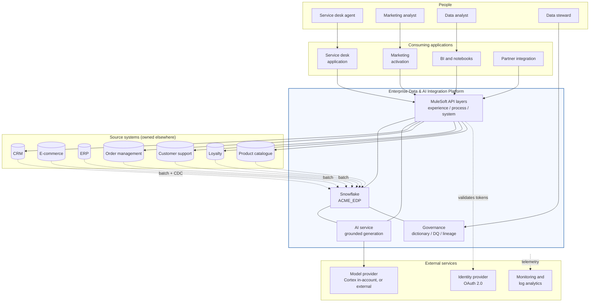

# 01 / Enterprise context

Who uses the platform, what it depends on, and where the boundary is.

## What the platform is accountable for

| In scope | Out of scope |
|---|---|
| Integrating customer data across sources | Owning any source system's data |
| A governed unified customer view | Replacing the CRM or the OMS |
| Governed AI over that view | General-purpose chat over enterprise data |
| API contracts and their lifecycle | The consuming applications themselves |
| Data quality measurement and quarantine | Fixing defects at source, that is the domain owner's job |
| Recovery of the platform's own data | Source system disaster recovery |

The last row on each side is the one that gets argued about. The platform
*reports* a data quality defect and quarantines the row; the domain owner fixes
the source. A platform that quietly corrects its inputs teaches the organisation
that the source does not matter.
