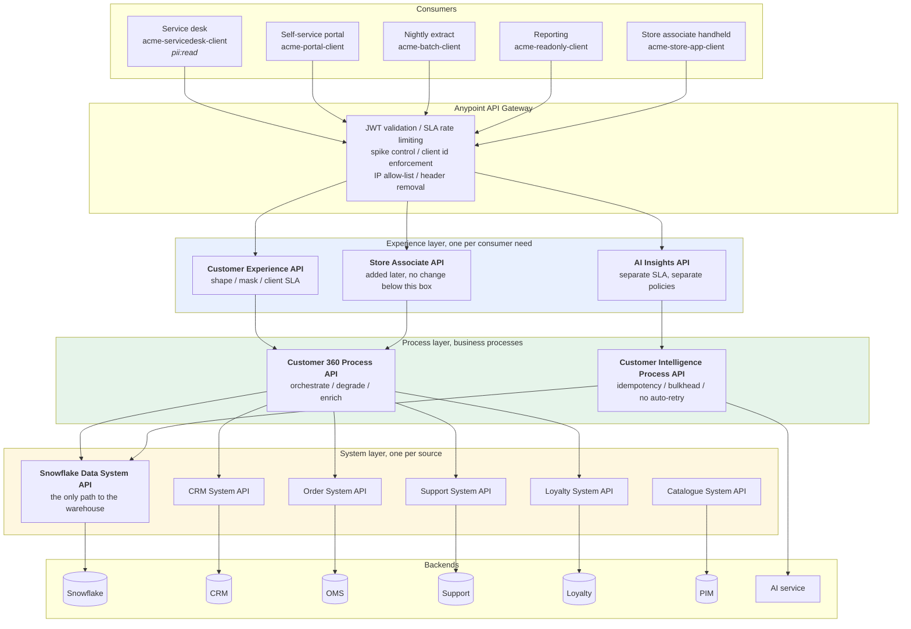

# 02 / API-led architecture

Every application, and the rule that governs each layer.



## The rule for each layer

| Layer | One reason to change | Must not contain | Checked by |
|---|---|---|---|
| Experience | A consumer's needs change | Orchestration, source knowledge | Review: a second outbound call means it belongs in the process layer |
| Process | The business process changes | Source field names, connection details | Review |
| System | A source system changes | Business logic, cross-source joins | Review: a join across two sources means it has become a process API |

## The claim this diagram makes

Replacing the CRM changes `CRM System API` and nothing else. The CRM's
`CustomerNumber` vocabulary exists in exactly one file:

```
mule/system-api/crm-system-api/src/main/resources/dw/crm-customer-to-canonical.dwl
```

Adding a consumer changes only the Experience layer. `Store Associate API` is
that claim exercised rather than illustrated: it is a later addition
(`mule/experience-api/src/main/mule/store-associate-experience-api.xml`) that
calls `C360` through the same `processApi` connection settings as
`Customer Experience API`, and nothing in `PRO`, `SYS` or `BE` above changed
to accommodate it - checked by
`tests/api/test_gateway_layers.py::test_both_experience_apis_reuse_the_same_process_endpoint`,
which asserts both experience APIs' calls land on the identical process path.
