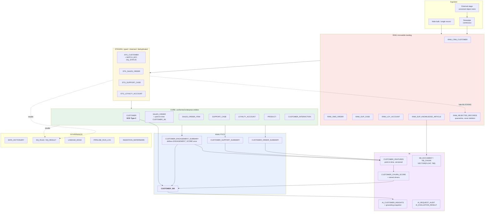
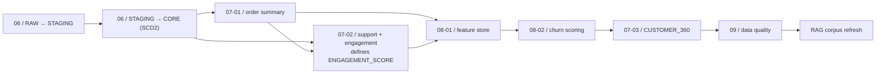

# 03 / Snowflake data architecture

## Build order, and why it is not alphabetical

There is a genuine dependency cycle to break: `CUSTOMER_360` wants the churn
probability for predicted CLV; churn scoring wants the feature store; the feature
store wants the ANALYTICS aggregates.

The same ordering is a task DAG in Snowflake and an explicit list in
`local_warehouse/build.py`.
