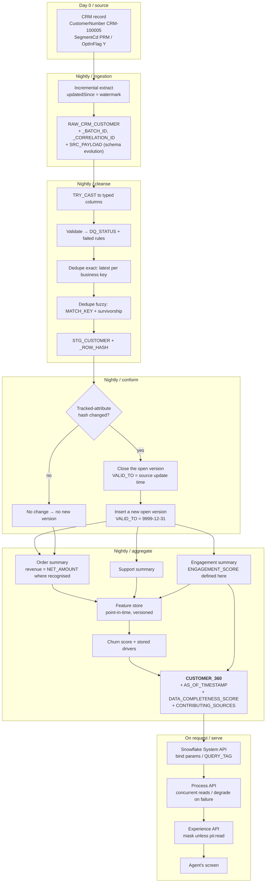
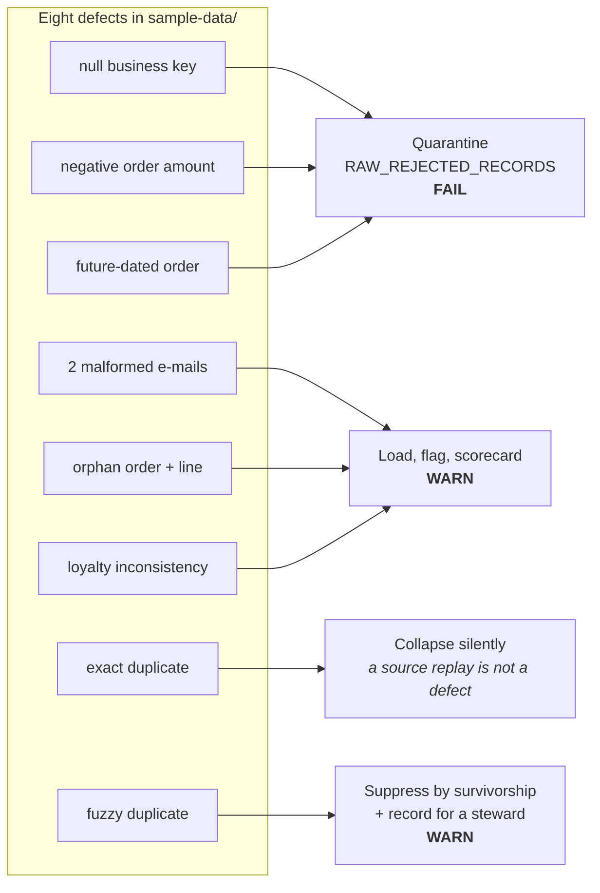

# 04 / Customer 360 data flow

From a record in a source system to a number on an agent's screen.

## What happens to each planted defect

Expected outcome on a fresh build: **14 PASS / 5 WARN / 3 FAIL**, asserted by
`tests/data/test_data_quality.py`.
