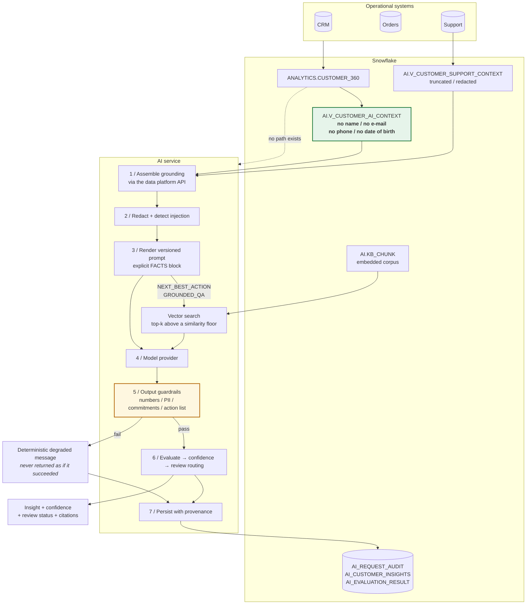
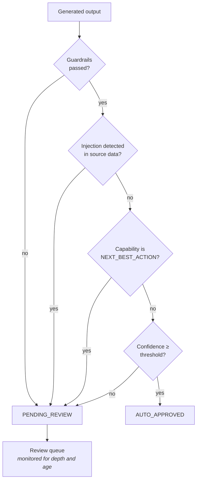
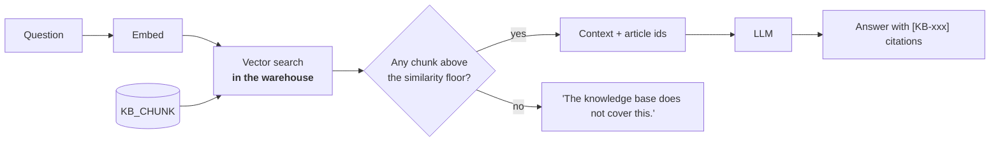

# 05 / AI architecture

## Human-in-the-loop routing

Everything else is auto-approved, deliberately: **a review queue nobody reads is
worse than no queue**, because it manufactures the appearance of oversight.

## RAG, and why the similarity floor matters

Without the floor, top-k always returns k chunks, so a question the knowledge
base does not cover still gets three confident-looking extracts and the model
answers from them. The floor makes "I don't know" reachable, and it is
tested.
