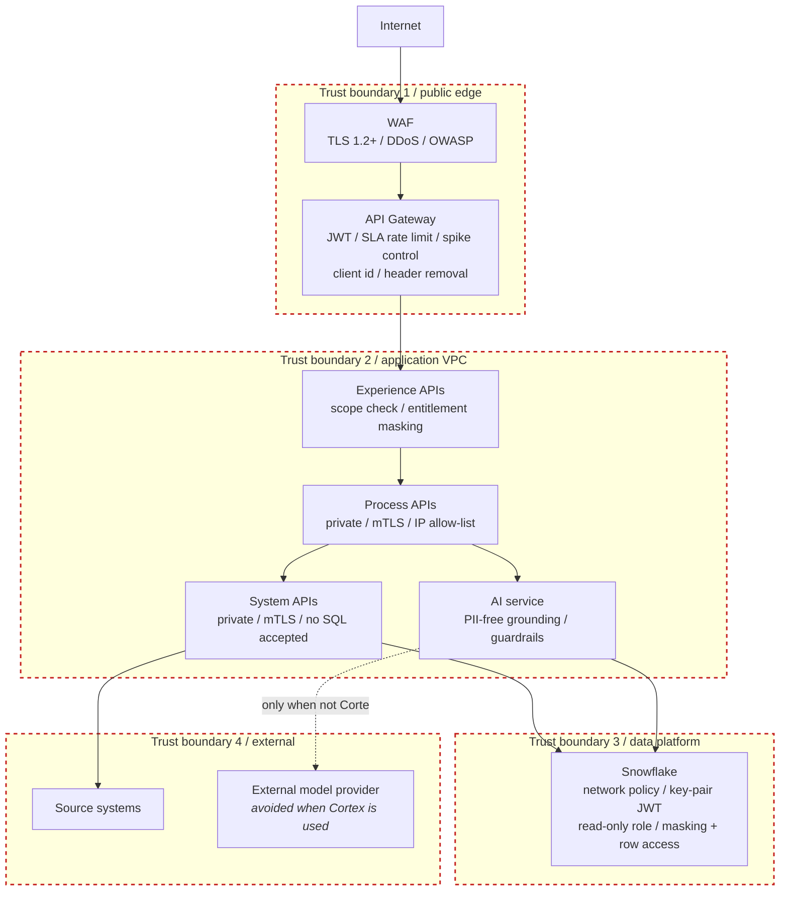
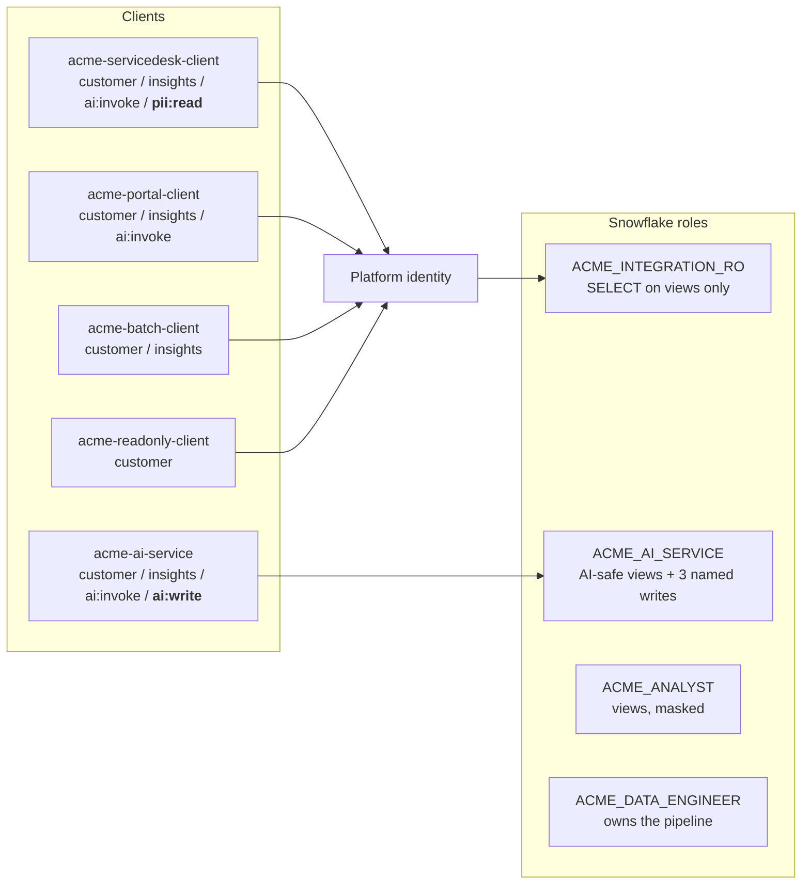
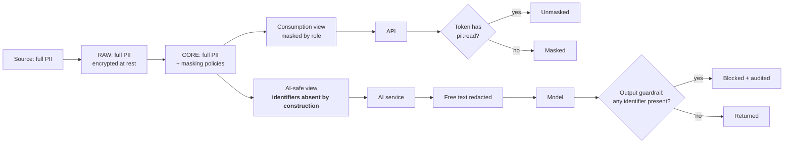

# 06 / Security architecture

## Identity and entitlement

Exactly one client holds `pii:read` and exactly one holds `ai:write`. That is
what makes an access review a one-row answer instead of an investigation.

## The PII journey

The AI-safe view does not *filter* identifiers, it never selects them. No code
path can leak one by omitting a filter, because there is no filter to omit.
