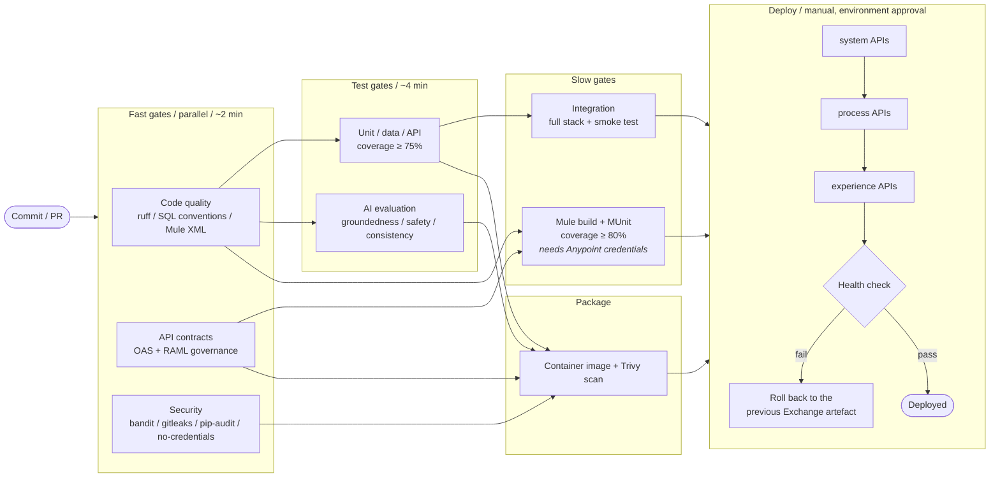

# 07 / CI/CD

## Why this order

**Fast gates first, in parallel.** A developer who has mis-formatted a file
learns in 40 seconds, not after a 12-minute Mule build.

**Nothing that needs a cloud account is required for a green build on a pull
request.** A contributor without an Anypoint licence or a Snowflake account can
run and pass the entire suite. That is the difference between a repository people
contribute to and one they read.

**Deploy system → process → experience.** A process API calling a system API that
does not yet have its new endpoint fails; the reverse does not.

## The gates, and what each one refuses to let through

| Gate | Refuses |
|---|---|
| Code quality | Lint failures; `SELECT *` in a consumption view; an unqualified object in a portable script; a read of an SCD2 table without `IS_CURRENT`; malformed Mule XML |
| API contracts | A spec that breaks the governance rules, verbs in paths, no 401, an unbounded collection endpoint, a missing error model |
| Security | Any credential, private key or account identifier in the tree; a HIGH bandit finding |
| Tests | Coverage below 75%; a sample dataset that is out of date; any failing invariant |
| AI evaluation | Generation that is less grounded, less safe or less consistent than the thresholds |
| Integration | A break in the cross-process behaviour: correlation propagation, degradation, entitlement masking |
| Mule | A failing MUnit test, or flow coverage below 80% |
