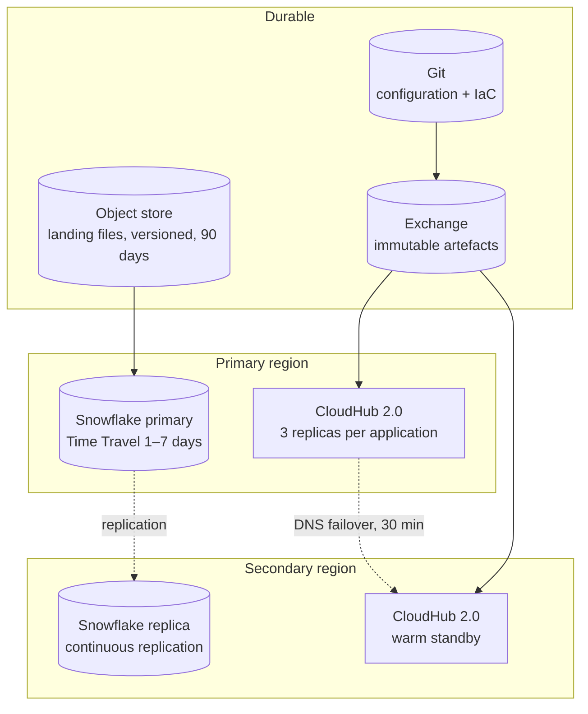
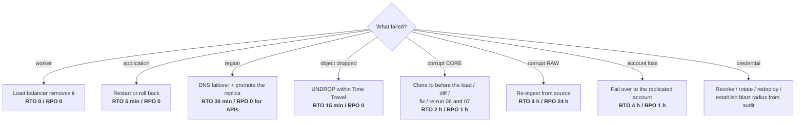
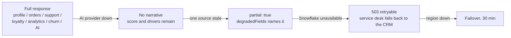

# 08 / Disaster recovery

All targets are architectural assumptions for this proof of concept, not
measured or agreed SLAs.

## Recovery paths by failure

Two rows carry the design argument:

- **The APIs have RPO 0 because they hold no state.** All state is in Snowflake
  or a source system. The object stores hold only idempotency keys and breaker
  flags, both safe to lose.
- **Corrupt CORE is a 2-hour re-run, not a restore**, because CORE is rebuildable
  from RAW. If CORE were the only copy this box would say "restore from backup"
  and the number would be much larger.

## Degradation ladder

The platform degrades in the direction of the deterministic.

## Exercise schedule

| Exercise | Frequency | Success criterion |
|---|---|---|
| Time Travel restore | Monthly | < 15 min, data verified |
| Rebuild CORE in a clone | Monthly | < 2 h, DQ suite matches expectations |
| Region failover in UAT | Quarterly | < 30 min, smoke test green |
| Chaos: kill a worker | Monthly | No client-visible error |
| Chaos: block Snowflake | Quarterly | 503 retryable, breaker opens, alert fires |
| Chaos: fail the AI provider | Quarterly | Degradation visible, no 500s |
| Credential rotation | Quarterly | No outage |

The fault-injection hooks in the mock services exist so the last three can be
exercised in CI, not only in UAT.
