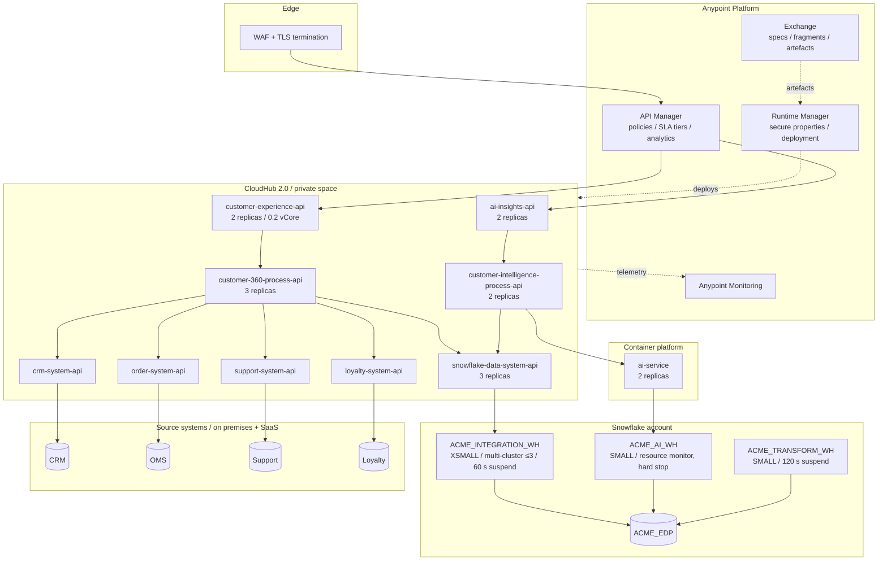
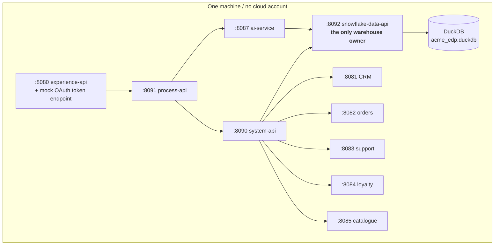

# 09 / Deployment topology

## Cloud

## Local, what `make run` starts

The warehouse has a single owner process because DuckDB permits one writer, and
every other service reaches it over the Snowflake SQL API contract. That
constraint pushed the AI service to read through the data platform's API rather
than opening the file, which is the better architecture in cloud mode too, for
reasons that have nothing to do with DuckDB.

## Mapping between the two

| Cloud | Local | Identical? |
|---|---|---|
| MuleSoft experience layer | `services/gateway/experience_layer.py` | Same contract, same policies |
| MuleSoft process layer | `services/gateway/process_layer.py` | Same contract, same degradation |
| MuleSoft system layer | `services/gateway/system_layer.py` | Same contract, same normalisation |
| Snowflake SQL API | `services/data_api/app.py` | Same wire contract |
| AI service | `services/ai_service/` | **Identical code**, different provider |
| Snowflake | DuckDB + dialect shim | Same portable SQL |
| Source systems | `services/mock_services/` | Same shapes and quirks |
