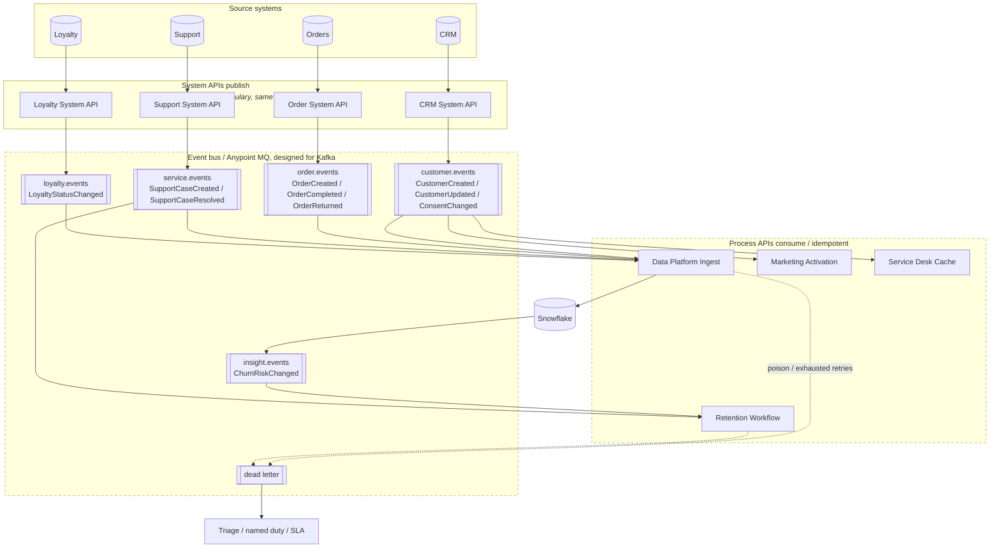
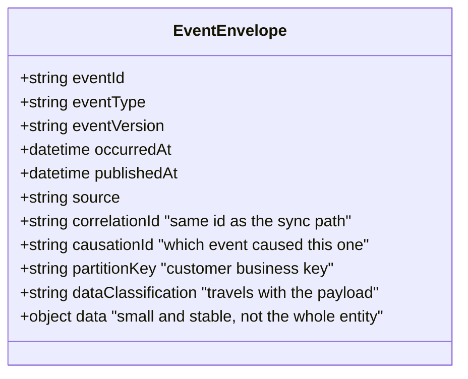
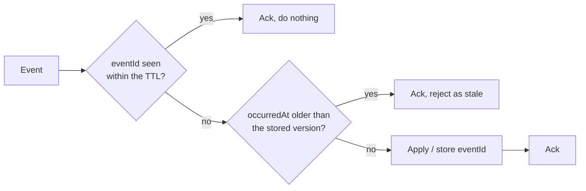

# 10 / Event-driven extension

**Designed, not built.** See [ADR-005](../docs/decisions/ADR-005-apis-versus-events.md)
for why, and [event-driven-architecture.md](../docs/event-driven-architecture.md)
for the full design.

## Envelope

## Consumer idempotency

At-least-once delivery plus deduplication at the consumer. Exactly-once across a
bus and a warehouse is a distributed transaction wearing a disguise.

The stale-update rejection uses `occurredAt` and the tracked-attribute hash,
the same mechanism the SCD2 batch loader already uses. That is not a
coincidence: **an event consumer writing to an SCD2 table is the batch loader
with a different trigger.**
