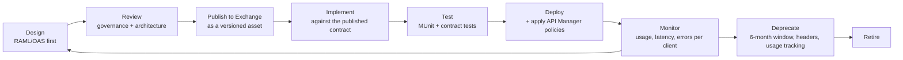

# API governance

Every rule here is checked by `scripts/validate_api_specs.py` in CI unless it is
marked *(review)*. A convention nobody enforces is a convention nobody follows.

## 1. Layer responsibilities

| Layer | Consumers | Publishes to | May contain | Must not contain |
|---|---|---|---|---|
| Experience | Client applications | Exchange, public portal | Payload shaping, entitlement masking, client SLA | Orchestration, source knowledge |
| Process | Experience APIs | Exchange, internal | Orchestration, business rules, degradation policy | Source field names, connection details |
| System | Process APIs | Exchange, internal | Source normalisation, connection management | Business logic, cross-source joins |

*(review)* Two rules a reviewer checks by hand, because no linter can:

1. If a change adds a **second outbound call** to an experience API, it belongs
   in a process API.
2. If a system API **joins two sources**, it has become a process API with the
   wrong name and the wrong blast radius.

## 2. Naming

| Rule | Good | Bad |
|---|---|---|
| Plural nouns for collections | `/customers` | `/customer`, `/getCustomers` |
| No verbs in paths, HTTP methods are the verbs | `POST /customers/{id}/ai-analysis` | `POST /createCustomerAnalysis` |
| Lower-case, hyphenated segments | `/churn-risk`, `/high-risk` | `/churnRisk`, `/churn_risk` |
| Numeric segments are allowed when they name a resource | `/customers/{id}/360` |, |
| camelCase JSON fields | `orderStatus` | `order_status`, `OrderStatus` |
| Warehouse column names never reach a consumer | `netAmount` | `NET_AMOUNT` |
| Canonical vocabulary, not the source's | `segment` | `customerSegment` (CRM), `SegmentCd` (CRM raw) |

The last one is the whole point of the system layer: the CRM calls the business
key `CustomerNumber` and that word does not exist above
`mule/system-api/crm-system-api`.

## 3. Versioning

- Major version in the URI: `/experience/v1/...`. It is visible in a log, a
  firewall rule and a support ticket, which a header is not.
- **Additive changes only** within a major version: new optional fields, new
  optional parameters, new endpoints. A consumer must never break because a
  producer added something.
- Breaking changes get a new major version. Both run side by side for a
  **6-month deprecation window**, with `Deprecation` and `Sunset` response
  headers on the old one and usage tracked per client in Exchange.
- Specification versions are semantic (`1.0.0`) and independent of the URI
  version. The URI says what a client can call; the semantic version says what
  changed.

## 4. HTTP semantics

| Method | Use | Idempotent |
|---|---|---|
| `GET` | Read. Never has a side effect, never has a body | Yes |
| `POST` | Create, or invoke an operation that is not a read | No: use `Idempotency-Key` |
| `PUT` | Full replace | Yes |
| `PATCH` | Partial update, JSON Merge Patch | No |
| `DELETE` | Remove | Yes |

| Status | Meaning here |
|---|---|
| 200 | Success, possibly partial: check `meta.partial` |
| 201 | Created, with a `Location` header |
| 202 | Accepted for asynchronous processing |
| 400 | The request is malformed or fails validation |
| 401 | No token, an expired token, or an invalid one |
| 403 | Valid token, insufficient scope |
| 404 | The resource does not exist |
| 409 | Conflicts with current state |
| 422 | Syntactically valid, semantically rejected |
| 429 | Rate limit exceeded, `Retry-After` is mandatory |
| 500 | Unexpected. Never leaks a stack trace |
| 502 | A downstream dependency failed |
| 503 | A downstream dependency is unavailable. Retryable |
| 504 | A downstream dependency timed out. Retryable |

**200 with `partial: true` and not a 5xx** is the important choice. When one
of five contributing systems is unavailable, an agent with a customer on the
phone is better served by the data we have plus an honest statement of what is
missing.

## 5. The error contract

One shape, every API, every layer:

```json
{
  "errorCode": "PLATFORM:RESOURCE_NOT_FOUND",
  "message": "The requested resource does not exist.",
  "correlationId": "acme-6f1c9a2e-6d0f-4d0b-9b3f-1f2a0b7d4c11",
  "timestamp": "2026-08-28T10:15:00Z",
  "path": "/api/v1/customers/CRM-000000/360",
  "retryable": false,
  "details": []
}
```

Rules:

- **`errorCode` is `DOMAIN:REASON`, stable, and the only thing a client may
  branch on.** Message text is for humans and may be reworded at any time.
- **`retryable` is part of the contract.** A client must not retry when it is
  false. It is what stops a 404 from becoming a retry storm.
- **`correlationId` is always present**, including on a 500. It is how support
  finds everything else.
- **`message` never contains** a stack trace, a downstream error verbatim, a SQL
  fragment, an internal hostname, or any customer data. Those go to the log,
  keyed by the correlation id.
- `details` carries field-level information for validation failures only.

Registered domains: `PLATFORM`, `DATA`, `AI`, `CUSTOMER`, `ORDER`.

The single implementation is `services/common/errors.py`; the Mule equivalent is
`mule/common/global-error-handler.xml` plus `dw/error-response.dwl`; the published
contract is `api-specs/fragments/error.oas.yaml`. Keeping the three in step is
what stops error handling from drifting between layers.

## 6. Correlation

`x-correlation-id` is accepted on every request and echoed on every response.
When the caller supplies one it is **adopted**, not replaced, a client that has
its own request id and gets a different one back cannot correlate its own logs
with ours, which is the entire purpose of the header.

The same id is propagated on every outbound call and used as the Snowflake
`QUERY_TAG`, so one id finds the API call, the flow logs, the warehouse query and
the AI audit row. See [observability.md](observability.md).

## 7. Pagination

Offset-based, and explicit:

```json
{
  "data": [ ... ],
  "pagination": { "limit": 20, "offset": 0, "total": 137, "hasMore": true }
}
```

- Default `limit` 20, maximum 200. **No unbounded collection endpoint exists**,
  it is a denial-of-service vector against the warehouse, and CI fails a
  collection endpoint that has no `limit` parameter.
- `hasMore` is published rather than left for the client to infer from
  `offset + limit >= total`, which is wrong the moment the collection changes
  between pages.
- Cursor pagination is the right answer for large, volatile collections and would
  be introduced per endpoint rather than platform-wide.

## 8. Idempotency

Any operation with a side effect that costs money accepts `Idempotency-Key`.
A repeated key within the TTL (15 minutes) returns the first response instead of
re-executing.

It is enforced at the **process layer**, not the experience layer, because that
is the boundary where a repeated call costs money, and because a second
experience API could call the same process API. The experience layer also checks,
which saves a network hop on the common case.

This matters because **every well-behaved client retries on timeout**. Without
idempotency, a client doing the right thing is billed twice.

## 9. Security requirements

- Every endpoint except `/health` requires a bearer token and declares its
  scopes.
- Every specification declares `401` and `403`; CI fails one that does not.
- Scopes are least-privilege and per client application, not per endpoint.
- No API accepts SQL, a file path, or a URL to fetch.
- Internal headers are stripped on the way out by the header-removal policy.

## 10. Documentation requirements

Every specification must have:

- `info.description` explaining what the API is *for*: a contract without a
  rationale is a guess;
- a semantic `info.version`;
- at least one server, HTTPS unless it is a local address, with the major version
  in the URL;
- `operationId`, `summary` and `tags` on every operation;
- at least one 2xx and the standard error responses;
- **realistic examples**. The examples in `api-specs/raml/.../examples/` and
  `docs/examples/` are captured from the running platform and not
  hand-written, so they cannot drift from what the API actually returns.

## 11. Lifecycle



**Contract first, always.** The implementation depends on the specification
published in Exchange; the specification is never generated from the
implementation. Generated specs describe what was built, which is the wrong way
round: the contract is the thing the consumer integrates against, and it should
exist before there is anything to integrate with.

## 12. Reuse

| Asset | Published as | Reused by |
|---|---|---|
| Error model | Exchange API fragment | Every API |
| Correlation-id trait | Exchange API fragment | Every API |
| Pagination schema | Exchange API fragment | Every collection endpoint |
| Security scheme | Exchange API fragment | Every API |
| Customer data type | Exchange API fragment | Experience and process APIs |

Fragments instead of copy-paste: the error shape is defined once, so it cannot
drift between six APIs. In OAS this is `$ref` into `api-specs/fragments/`; in
RAML it is `!include` of a published fragment.

## 13. Deprecation

1. Announce in Exchange with a target date; notify every registered consumer of
   the API instance.
2. Add `Deprecation` and `Sunset` headers to responses.
3. Track usage per client. A consumer that has not migrated with a month to go
   gets a direct conversation, not another e-mail.
4. Retire only when usage is zero, or the date passes with an accepted risk.

Usage tracking makes the window real. Without it, deprecation is a
request and the old version runs forever.
