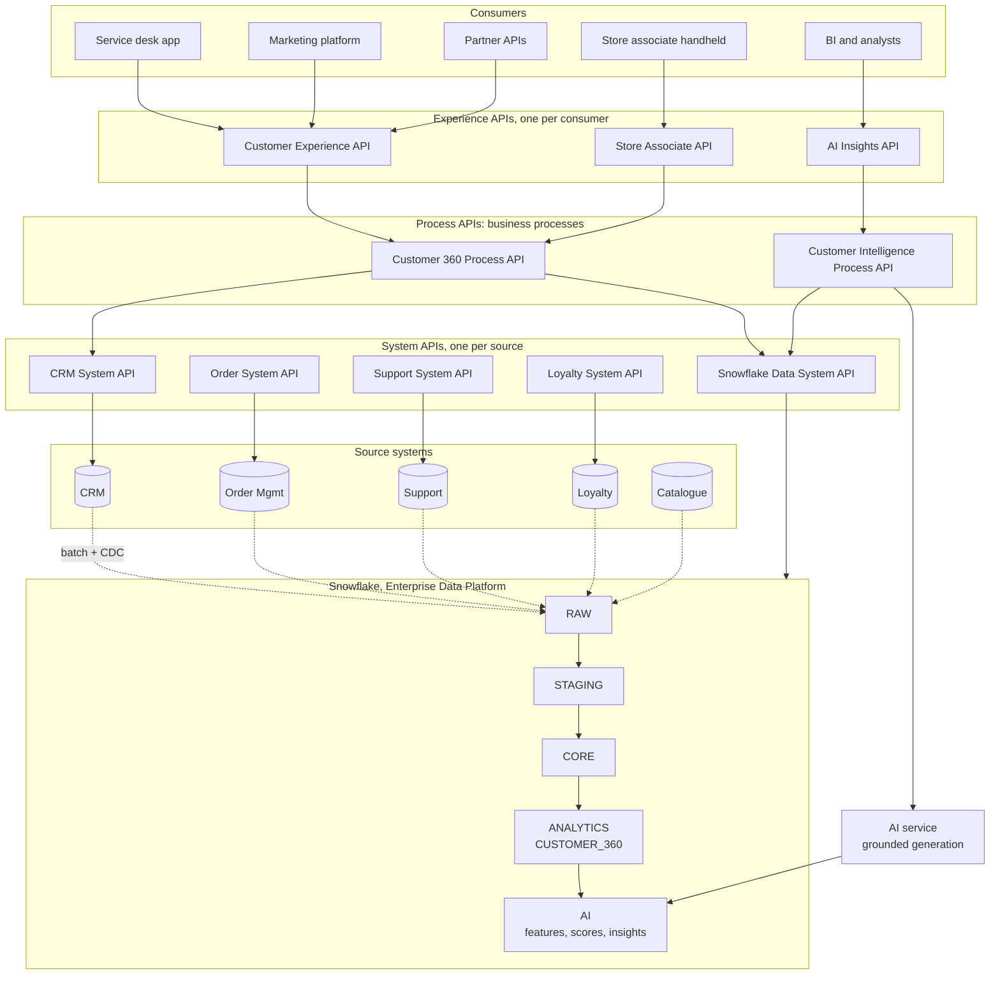
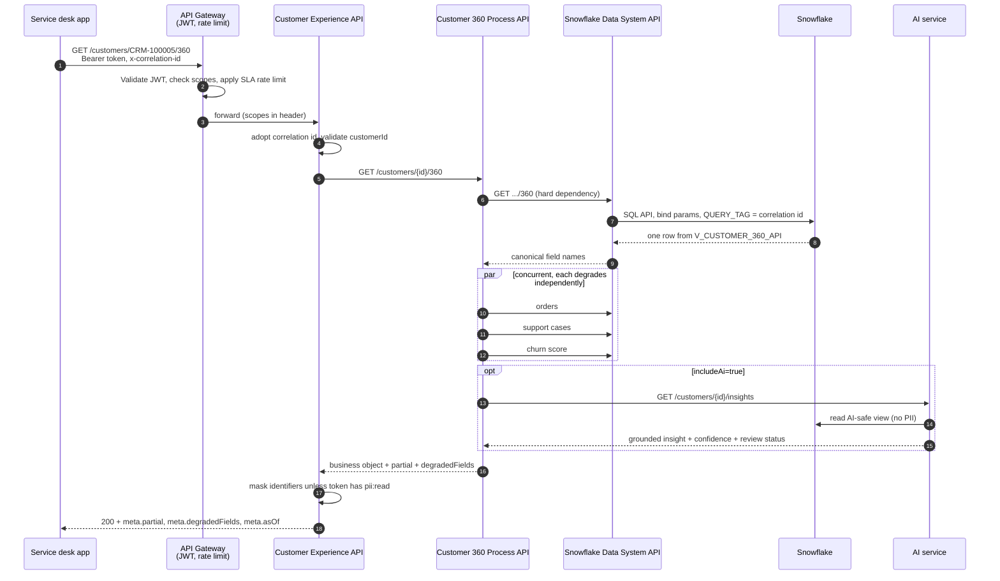

# Architecture

> Acme Retail Corporation: Enterprise Data & AI Integration Platform
> Architecture and proof of concept. Independent work; not a description of any
> organisation's production system.

---

## 1. The problem

Acme Retail runs seven systems that each hold part of the truth about a customer:

| System | Holds | Doesn't hold |
|---|---|---|
| CRM | Identity, contact details, segment, consent | What they bought |
| E-commerce | Web and app behaviour | In-store activity |
| ERP | Financial settlement | Customer intent |
| Order Management | Orders and lines | Why an order was returned |
| Customer Support | Cases, satisfaction, resolutions | Order value |
| Loyalty | Tier, points, enrolment | Service history |
| Product Catalogue | Product master data | Anything about customers |

Three consequences follow, and each is an architectural requirement and not
a complaint:

1. **Nobody can answer a whole-customer question.** "Is this customer worth
   retaining?" needs order value, service history and loyalty standing at once.
   Today an analyst assembles it by hand, differently each time.
2. **Every new consumer is a new integration.** The service desk, the marketing
   platform and the finance team each built their own point-to-point extract.
   Twelve consumers over seven systems is up to eighty-four connections, and
   each one is a separate place for a schema change to break something.
3. **AI cannot be introduced safely.** There is no governed, PII-controlled,
   point-in-time view for a model to read. Pointing an LLM at the CRM would give
   it the blast radius of an unaudited admin account.

## 2. What this platform is

Three layers, each solving one of the above:



**Integration layer (MuleSoft).** API-led connectivity. The claim being made is
narrow and checkable: when the CRM is replaced, exactly one application changes
(`mule/system-api/crm-system-api`) and nothing else does. See
[ADR-001](decisions/ADR-001-api-led-connectivity.md).

**Data platform (Snowflake).** A layered warehouse whose top layer is a
materialised, explainable Customer 360. See
[ADR-002](decisions/ADR-002-snowflake-data-platform.md) and
[data-architecture.md](data-architecture.md).

**AI layer.** A separate service that reads a curated, PII-free, point-in-time
view and produces grounded, audited, reviewable output. It has no access to any
source system. See [ADR-004](decisions/ADR-004-ai-separated-from-integration.md)
and [ai-architecture.md](ai-architecture.md).

## 3. Why three layers and not two

The most common objection to API-led connectivity is that it adds a hop. It
does. What it buys is worth more than the 15–30 ms:

| Without the layering | With it |
|---|---|
| Each consumer learns the CRM's `CustomerNumber`, the OMS's `status` field, and the loyalty platform's habit of 404-ing for unenrolled customers | Those quirks are absorbed once, in one application each |
| A source system change is a co-ordinated release across every consumer | It is a change to one system API |
| Adding a consumer means writing another integration | It means writing an experience API over process APIs that already exist |

The Store Associate API is that row, not a hypothetical: a second experience
application (`mule/experience-api/.../store-associate-experience-api.xml`,
`api-specs/oas/store-associate-experience-api.v1.yaml`) that calls the same
Customer 360 Process API `C360` node in the diagram above, through the same
`processApi` connection settings, with a different contract, a thinner shape
and a narrower OAuth client. Neither `C360` nor anything below it changed to
add it. `tests/api/test_gateway_layers.py::test_both_experience_apis_reuse_the_same_process_endpoint`
checks that both experience APIs' calls land on the identical process path.
| Entitlement and masking are re-implemented per consumer, differently | They are enforced once, at the edge, from the token |
| A source outage takes down whatever depended on it | The process layer degrades and says which part is missing |

The layering also gives each layer a *single reason to change*, which is what
makes the estate governable:

| Layer | Changes when | Must not contain |
|---|---|---|
| Experience | A consumer's needs change | Orchestration, source knowledge |
| Process | The business process changes | Source-specific field names, connection details |
| System | A source system changes | Business logic, cross-source joins |

Reviewers check those "must not contain" rules by hand; they are listed in
[CONTRIBUTING.md](../CONTRIBUTING.md).

## 4. The Customer 360 request, end to end



Points worth noticing, because they are where most implementations go wrong:

- **The three secondary reads are concurrent.** Sequential orchestration would
  make the endpoint as slow as the *sum* of its dependencies instead of as slow
  as its slowest one.
- **Only the core profile is a hard dependency.** Everything else degrades.
- **Masking happens at the edge, from the token**, not from a request parameter.
- **The correlation id is adopted from the caller**, propagated on every hop, and
  used as the Snowflake `QUERY_TAG`, so one id finds the API call, the flow
  logs, the warehouse query and the AI audit row.

## 5. What actually runs in this repository

The Mule 4 applications in `mule/` are the real implementation of the three
layers, and they need a Mule runtime to execute. So that the architecture is
demonstrable and not merely described, `services/gateway/` implements the
same three layers, the same contracts, the same policies and the same error
semantics in Python, as three separate processes.

```
:8080 experience-api        ← services/gateway/experience_layer.py       ≡ mule/experience-api (customer-experience-api.xml)
:8093 store-experience-api  ← services/gateway/store_experience_layer.py ≡ mule/experience-api (store-associate-experience-api.xml)
:8091 process-api           ← services/gateway/process_layer.py          ≡ mule/process-api
:8090 system-api            ← services/gateway/system_layer.py           ≡ mule/system-api
:8092 snowflake-data-api    ← services/data_api/app.py                   ≡ Snowflake SQL API
:8087 ai-service            ← services/ai_service/                       (identical in both modes)
:8081-8085 mock CRM, OMS, Support, Loyalty, Catalogue
```

`:8080` and `:8093` are two Python processes for two consumers, matching two
flows inside the *same* Mule application module (`mule/experience-api`) - a
second deployable Mule application was never needed, only a second flow and
a second RAML, because the experience layer is exactly the boundary meant to
absorb a new consumer.

Where the Python and the Mule differ, **the Mule application is the
authoritative statement of the design**. Every Python module names the Mule file
it mirrors.

The full mapping:

| Concern | Mule 4 | Python stand-in |
|---|---|---|
| Routing and contract enforcement | APIkit router against the RAML | FastAPI + Pydantic models |
| Retry | `until-successful` | `retry_async` with full jitter |
| Circuit breaking | Object store flag + reliability pattern | `CircuitBreaker` |
| Bulkhead | Bounded connection pool / max concurrency | `asyncio.Semaphore` |
| Idempotency | `os:store` on a persistent object store | `IdempotencyStore` |
| Correlation | `correlationId` + header propagation | `CorrelationIdMiddleware` |
| Auth | API Manager JWT policy | `require_scopes` dependency |
| Rate limiting | API Manager SLA policy | `RateLimitMiddleware` |
| Transformation | DataWeave | Python mapping functions |
| Error contract | `global-error-handler.xml` + `error-response.dwl` | `common/errors.py` |

## 6. Technology choices, in one line each

| Choice | Why | ADR |
|---|---|---|
| MuleSoft over point-to-point or a plain gateway | API-led decomposition, policy enforcement outside application code, a reusable asset catalogue | [ADR-001](decisions/ADR-001-api-led-connectivity.md) |
| Snowflake over a lakehouse or a warehouse appliance | Separation of storage and compute lets an interactive API and a nightly batch use different-sized warehouses on the same data; zero-copy cloning makes non-production environments effectively free | [ADR-002](decisions/ADR-002-snowflake-data-platform.md) |
| Materialised Customer 360 over a view | Latency budget, cost, and reproducibility of AI grounding | [ADR-003](decisions/ADR-003-customer-360-materialised.md) |
| A separate AI service over AI inside Mule flows | Different latency, cost, failure and governance profile | [ADR-004](decisions/ADR-004-ai-separated-from-integration.md) |
| Snowflake SQL API over JDBC from Mule | Ephemeral workers, warehouse auto-suspend, platform-level resilience, async statements | [ADR-006](decisions/ADR-006-snowflake-sql-api-over-jdbc.md) |
| APIs now, events next | An event bus is the right answer for propagation, not for request/response; introducing both at once doubles the operational surface before either is proven | [ADR-005](decisions/ADR-005-apis-versus-events.md) |
| Rule-weighted churn baseline over a fitted model | There is no labelled churn outcome. A stated heuristic is honest; a fabricated AUC is not | [ADR-007](decisions/ADR-007-transparent-churn-baseline.md) |
| DuckDB local warehouse over mocks | Lets the actual transformation SQL run in CI | [ADR-008](decisions/ADR-008-local-runnable-platform.md) |

## 7. Quality attributes and how they are addressed

| Attribute | Target (architectural assumption, not a measured SLA) | Mechanism |
|---|---|---|
| Latency | Customer 360 p95 < 800 ms | Materialised 360; concurrent orchestration; per-hop timeout budget that shrinks inward |
| Availability | 99.9% for read paths | Multi-worker CloudHub deployment; degradation instead of failure; the read path does not depend on any source system being up |
| Throughput | 100 req/s sustained on the read path | Stateless workers; XSMALL multi-cluster warehouse; no per-request generative call |
| Cost | AI spend capped and attributable | Separate `ACME_AI_WH` with its own resource monitor; per-client audit; insight caching; opt-in generative calls |
| Security | Least privilege end to end | OAuth scopes per client; read-only warehouse role; masking at the edge; no arbitrary SQL |
| Recoverability | RTO 4h / RPO 1h (assumption) | Rebuildable STAGING and ANALYTICS; Time Travel; documented restore order, see [resilience-and-dr.md](resilience-and-dr.md) |
| Observability | Any request traceable in one query | One correlation id across Mule, Snowflake `QUERY_TAG` and the AI audit table, see [observability.md](observability.md) |
| Evolvability | A source system swap touches one application | Layer boundaries; contract-first specs; views as the data contract |

## 8. Where this goes next

- **Events for propagation.** `CustomerUpdated`, `OrderCompleted` and
  `SupportCaseCreated` published to Anypoint MQ or Kafka, moving Customer 360
  from nightly to near-real-time for the fields that need it. Designed in
  [event-driven-architecture.md](event-driven-architecture.md), not built.
- **A fitted churn model.** The feature store and the score table already have
  the right shape; `SCORING_METHOD` lets a trained model run alongside the
  baseline until it demonstrably beats it.
- **Salesforce Data 360 / Data Cloud.** The Customer 360 model, the identity
  resolution keys and the calculated insights map onto Data Cloud's DMO / calculated
  insight structures; see [deployment.md](deployment.md) §7.

## 9. What this proof of concept does not do

Stated plainly, because a portfolio project that pretends otherwise is worse
than one that admits it:

- No real Snowflake account is exercised by CI. The SQL is written for
  Snowflake and runs against DuckDB locally through a documented, on purpose
  small dialect shim; the constructs that cannot be translated are listed and
  skipped, not faked.
- The Mule applications are not built in CI unless Anypoint credentials are
  present, and they have never been deployed to CloudHub.
- The churn score is a stated heuristic, not a trained model, because the
  dataset has no labelled churn outcome.
- The local embedding model is lexical (hashed TF-IDF with light stemming), not
  semantic. It is enough to make retrieval, including *failing* to retrieve,
  demonstrably correct on a ten-article corpus; it is not a sentence transformer.
- Volumes are small: 60 customers, ~350 orders. The architecture is sized for
  millions in [data-architecture.md](data-architecture.md) §9, but nothing here
  has been load-tested.
