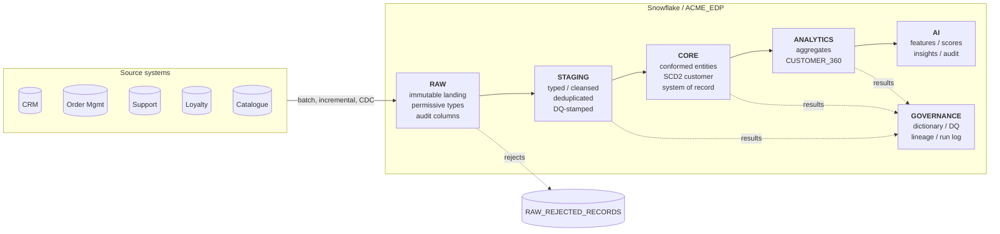
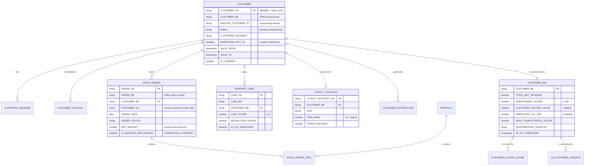
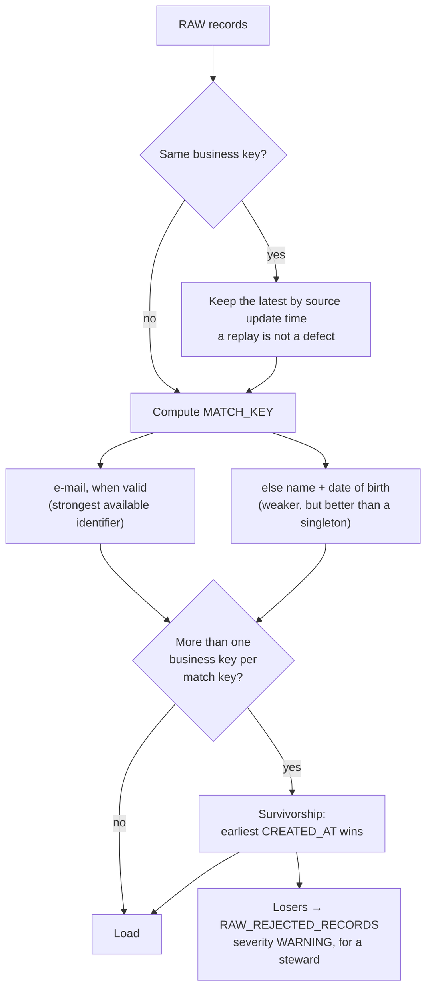

# Data architecture

## 1. Layers, and what each one is allowed to be



| Layer | Purpose | Rebuildable? | Retention | Who may read it |
|---|---|---|---|---|
| `RAW` | Immutable landing, source-shaped | No, it *is* the archive | 1 day Time Travel, 90 days in the stage | Platform engineers only |
| `STAGING` | Typed, cleansed, deduplicated | Yes, from RAW | 1 day | Platform engineers only |
| `CORE` | Conformed enterprise entities with history | Yes, from STAGING | 7 days | Analysts, via views |
| `ANALYTICS` | Consumption-shaped models | Yes, from CORE | 7 days | APIs and BI, via views |
| `AI` | Features, scores, generated content, audit | Features yes; generated content **no** | 7 days / 24 months for audit | The AI service and reviewers |
| `GOVERNANCE` | Dictionary, DQ rules and results, lineage, run log | Rules no; results yes | 30 days | Stewards, everyone read-only |

The rule that makes this work: **STAGING and ANALYTICS are disposable.** A bug
in cleansing logic is fixed by re-running, not by a recovery exercise. That is
only true if nothing writes to them except the pipeline, which is enforced by
the RBAC in `snowflake/10-security/`.

## 2. Conceptual model



## 3. Data domains and bounded contexts

Each domain has one owner and one system of record. Where two systems hold the
same concept, the model names the winner rather than averaging them.

| Domain | Owner | System of record | Bounded context boundary |
|---|---|---|---|
| Customer | VP Customer Experience | CRM | Identity, consent, segment. Ends where behaviour begins. |
| Order | VP Commerce | Order Management | Orders, lines, fulfilment status. Does **not** own product master data. |
| Product | VP Merchandising | PIM | Product master. Order lines reference it; they do not copy it. |
| Service | VP Customer Service | Support platform | Cases, satisfaction, resolutions. |
| Loyalty | VP Loyalty | Loyalty platform | Tier, points, enrolment. |
| Analytics | Data Platform Owner | This platform (derived) | Every derived metric. Nothing upstream may claim to own one. |
| AI | AI Platform Owner | This platform (derived) | Features, scores, generated content. |

**The context boundary that matters most:** "customer" in the CRM means a
contactable individual; "customer" in the OMS means a billing party. They are
not the same thing, and reconciling them is the identity-resolution job in §5,
not something to paper over with a join.

## 4. Keys

| Kind | Convention | Why |
|---|---|---|
| Business key | The source's natural key, verbatim (`CRM-100005`) | It is what humans quote in a support ticket. Never re-mapped. |
| Surrogate key | `MD5(business key [+ effective date])` | Computable independently in any layer, in any order, after any reload |
| Master id | Survivorship winner after identity resolution | Lets duplicates be linked without destroying the originals |

Deterministic hash keys rather than sequences, intentionally. A sequence key
depends on *insert order*, which means a rebuilt warehouse produces different
keys and every stored reference silently breaks. A hash key does not, which is
what makes "STAGING and ANALYTICS are disposable" a true statement rather than
an aspiration.

## 5. Identity resolution

Two stages, because they solve different problems:



Survivorship rule: **the earliest created record wins.** It is the one other
systems already reference, so promoting a newer duplicate would break external
references to fix an internal one.

The suppressed duplicate is *recorded*, not discarded. Silently collapsing
duplicates is how a duplicate-customer problem becomes invisible and not
solved: the count goes down and nobody fixes the source.

Production would add a probabilistic tier (address similarity, phone
normalisation, name distance) with a review queue for scores in the uncertain
band. The deterministic tier here is the honest floor.

## 6. Slowly changing dimensions

`CORE.CUSTOMER` is Type 2. `CORE.CUSTOMER_ADDRESS`, `PRODUCT`, `SUPPORT_CASE`,
`SALES_ORDER`, `CUSTOMER_INTERACTION` and `LOYALTY_ACCOUNT` are not.

**Why customer is historised.** Three questions cannot be answered without it,
and all three get asked:

1. "What segment was this customer in when they placed that order?". Attribution.
2. "Did they consent to marketing at the time we mailed them?", regulatory.
   Consent history is evidence, not analytics.
3. "When did they move from SILVER to GOLD?". Programme measurement.

**Why nothing else is.** Historising by default produces a warehouse that is
both expensive and unqueryable. An order is a transactional fact, immutable once
complete. Nobody has asked a question that needs the history of a product's
sub-category. When someone does, that table becomes Type 2 and the others stay
as they are.

Implementation notes worth defending:

- `VALID_FROM` is the **source** update timestamp, not the load timestamp. Using
  load time makes history depend on when the pipeline happened to run, which
  makes every point-in-time answer wrong after a backfill.
- `VALID_TO` for the open row is `9999-12-31`, never `NULL`. A NULL forces every
  downstream predicate to special-case it, and someone always forgets.
- Change detection is a hash over **tracked attributes only**; audit columns are
  excluded, so re-ingesting an unchanged record does not create a version.
- `CORE.SALES_ORDER.CUSTOMER_SK` points at the customer version current at the
  order date. That single column is the payoff of the whole Type 2 design.
- Three invariants are asserted by tests and by DQ rules: exactly one current
  version per customer, no overlapping validity windows, and no open row with a
  `VALID_TO` in the past.

## 7. Derived metrics: every definition, stated

The rule: **anything shown to a person or given to a model must be explainable
in one sentence.** An unexplainable number in a customer-facing context is a
liability.

### Revenue

```
revenue = SUM(NET_AMOUNT) for orders in (COMPLETED, SHIPPED)
NET_AMOUNT = ORDER_AMOUNT - DISCOUNT_AMOUNT      (shipping excluded)
```

CANCELLED and RETURNED orders count for *behaviour* and never for revenue.
Defined once in `07-customer-360/01-order-summary.sql`; `CUSTOMER_360` reads it
instead of recomputing it. Two dashboards disagreeing about a customer's spend
is almost always two implementations of this line.

### Engagement score (0–100)

Defined once in `07-customer-360/02-support-and-engagement-summary.sql` and read
by both `CUSTOMER_360` and the AI feature store.

| Component | Weight | Saturates at |
|---|---:|---|
| Recency of ordering | 30 | decays linearly to 0 at 365 days |
| Order frequency | 25 | 12 orders per year |
| Interactions in the last 90 days | 15 | 10 interactions |
| Loyalty standing | 15 | PLATINUM (tier rank 4) |
| Service health (average CSAT) | 15 | CSAT 5; zero at CSAT 1 |
| Negative-signal penalty | −10 | 3 signals |

The weights are a **documented business assumption**, agreed with the customer
experience team, not a fitted model. Calling them a model would be a lie that
survives exactly one question.

### Customer lifetime value

```
CUSTOMER_LIFETIME_VALUE = realised net revenue to date        (a fact)
PREDICTED_CLV_12M       = AOV × annualised frequency × (1 − churn probability)
```

Two columns, never merged. Conflating realised and predicted value is how a
forecast ends up quoted in a board pack as revenue. A test asserts they stay
distinct.

### Tenure

Days since the **earlier** of CRM creation and first order. Some customers
transacted before their CRM record existed; using the CRM date alone understates
tenure and therefore overstates churn risk for exactly the wrong cohort.

### Data completeness score

Percentage of eight profile attributes populated. Surfaced through the API so a
consumer can distinguish "this customer has no support history" from "the
support system was unavailable", a distinction that cannot be added later
without breaking every consumer that assumed silence meant absence.

## 8. Ingestion patterns

| Pattern | Where used | Mechanism | Cadence |
|---|---|---|---|
| Full snapshot | Product catalogue (small, changes rarely) | Export → external stage → `COPY INTO` | Nightly |
| Incremental by watermark | CRM customers, OMS orders, support cases | `updatedSince` = `GOVERNANCE.INGESTION_WATERMARK.LAST_VALUE` | Hourly |
| CDC | Designed, not built, see below | Snowpipe + streams + tasks on a CDC feed | Continuous |
| Event-driven single record | Designed, see [event-driven-architecture.md](event-driven-architecture.md) | Mule consumes an event, calls the Snowflake System API | Real time |

**Watermarks are advanced only after a load commits.** A failed run therefore
re-reads rather than skips. The opposite: advancing the watermark on read, is
the single most common cause of silent data loss in an incremental pipeline, and
it is invisible until someone reconciles counts months later.

**CDC design (not implemented).** Debezium or the source vendor's log reader
writes change events to an object store; Snowpipe ingests continuously into a
RAW change table; a stream over that table feeds a task that MERGEs into
STAGING and then CORE. The SCD2 MERGE for this path is written in
`snowflake/05-pipelines/03-incremental-scd2-merge.sql`. It is marked
Snowflake-only because DuckDB has no `MERGE`, so the local build uses the
full-rebuild path: which produces the same end state and can also recover a
corrupted CORE from RAW without a restore.

## 9. Sizing and cost at realistic volumes

Everything here is an architectural estimate, not a measurement.

| Entity | POC | Assumed production | Growth |
|---|---:|---:|---|
| Customers | 60 | 8 million | +15%/year |
| Orders | 351 | 40 million/year | +10%/year |
| Order lines | 841 | 120 million/year | |
| Support cases | 129 | 2 million/year | |
| Interactions | 401 | 500 million/year | the volume driver |

Design consequences at that scale:

- **Cluster keys**, not indexes: `SALES_ORDER` on `(ORDER_DATE, CUSTOMER_BK)`,
  `CUSTOMER_INTERACTION` on `(INTERACTION_TS)`. Micro-partition pruning is what
  makes a date-ranged query cheap.
- **Interactions are aggregated on ingest**, not stored raw at full fidelity in
  CORE, because nobody queries individual email opens, they query counts.
- **`CUSTOMER_360` stays a full rebuild** while it takes minutes on an XSMALL.
  The switch to incremental (a stream on CORE driving a MERGE) is a change to
  one script, and the trigger is cost, not elegance.
- **Warehouse separation is a cost control**: `ACME_INTEGRATION_WH` is XSMALL
  with 60-second auto-suspend because API traffic is bursty; `ACME_TRANSFORM_WH`
  is SMALL for a few minutes a day; `ACME_AI_WH` is separate so AI spend is
  attributable and capped by its own resource monitor.

## 10. Data contracts

The consumption views in `snowflake/03-views/` are the contract. A consumer that
reads a base table has taken a dependency nobody agreed to.

| Contract | Consumer | Guarantee |
|---|---|---|
| `ANALYTICS.V_CUSTOMER_360_API` | Snowflake System API | Column set and types are stable within a major version; additive change only |
| `AI.V_CUSTOMER_AI_CONTEXT` | AI service | Contains **no** direct identifiers, by construction |
| `AI.V_CUSTOMER_SUPPORT_CONTEXT` | AI service | Truncated free text, last 12 months |
| `GOVERNANCE.V_DQ_LATEST` | Observability, the API | One row per active rule |
| `CORE.V_CUSTOMER_CURRENT` | Analysts | `IS_CURRENT` applied, so nobody forgets it |

`V_CUSTOMER_AI_CONTEXT` is the important one. It does not filter PII out, it
never selects it. No code path can leak a name or an e-mail address by omitting
a filter, because there is no filter to omit.

## 11. Lineage

`GOVERNANCE.LINEAGE_EDGE` holds **declared** lineage, including the two edges
that leave the warehouse and enter MuleSoft. Snowflake's `ACCESS_HISTORY` gives
**observed** lineage. The gap between them is the control:

- an observed edge with no declared counterpart is undocumented coupling;
- a declared edge never observed is dead code.

Most lineage tooling stops at the database boundary, which is where the
interesting question lives: *where does this number on the agent's screen come
from?*
