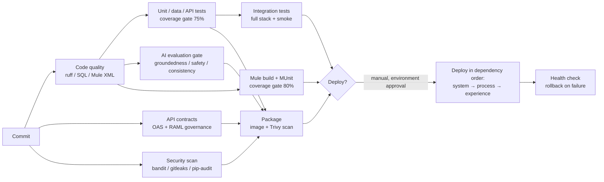

# Deployment

## 1. Environments

| Environment | Purpose | Data | Anypoint | Snowflake |
|---|---|---|---|---|
| Local | Development and demonstration | Synthetic (`sample-data/`) | None, Python stand-in | None: DuckDB |
| Dev | Integration | Synthetic + masked subset | Development | `ACME_EDP_DEV` (zero-copy clone) |
| UAT | Acceptance, performance, DR rehearsal | Masked production copy | UAT | `ACME_EDP_UAT` (clone) |
| Production |: | Production | Production | `ACME_EDP` |

Non-production Snowflake environments are **zero-copy clones**, which makes
"refresh dev from prod" a minute-long operation with no storage cost. Masking
policies apply in the clone, so a developer with `ACME_ANALYST` sees masked
values without a separate scrubbing pipeline.

Differences between UAT and production are deliberately few. Where they diverge,
UAT stops being a test of production. The only intended differences are the
downstream timeout (4 s vs 5 s), the endpoint hostnames (private DNS in
production), and replica count.

## 2. Running locally

```bash
git clone <repo> && cd enterprise-data-ai-integration-platform
make setup        # python dependencies
make build        # builds the local warehouse from sample data
make run          # starts 10 processes; or `make up` for docker compose
make smoke        # end-to-end demonstration
make test         # 245 tests including the AI evaluation gate
```

No cloud account, licence or API key is required. `make build` prints exactly
which Snowflake scripts it ran and which it skipped, with the reason:

```
[3/6] Transformations
  OK    06-transformations/01-raw-to-staging-customer.sql  (2 statements)
  ...
[5/6] Data quality
  RUN   22 rules -> {'PASS': 14, 'WARN': 5, 'FAIL': 3}
```

## 3. The local warehouse, and what it is not

`local_warehouse/` executes the **portable** scripts in `snowflake/` verbatim
after a small, explicit dialect rewrite. The transformation logic in this
repository is therefore the logic that runs in the demo, not a parallel copy
that can silently drift.

Snowflake-only scripts are skipped and the reason is printed. The complete list
of what is rewritten and what is skipped is in `local_warehouse/dialect.py` and
is asserted by `tests/unit/test_sql_dialect.py`.

| Aspect | Local (DuckDB) | Snowflake |
|---|---|---|
| Transformation SQL | The same scripts | The same scripts |
| SCD2 load | Full-rebuild script | `MERGE` over a stream |
| Ingestion | Python loader from `sample-data/` | Snowpipe / external stage / Mule bulk |
| Vector search | `list_cosine_similarity` | `VECTOR_COSINE_SIMILARITY` on `VECTOR(FLOAT, 768)` |
| Embeddings, LLM | Deterministic local implementation | Cortex `EMBED_TEXT_768` / `AI_COMPLETE` |
| Masking, row access policies | Not enforced | Enforced by policy objects |
| Time Travel, cloning, failover | Absent | Native |
| Cost model | None | Credits |

The philosophy behind the shim: keep the rewrite list **small, explicit and
auditable**. A half-working general-purpose SQL translator is worse than an
honest boundary, because it produces subtly different results instead of an
error.

## 4. What changes when you move to a real account

### Snowflake

1. Run `snowflake/00-database` and `01-schemas` as `SYSADMIN`.
2. Run `10-security` as `SECURITYADMIN`, roles, grants, masking policies, row
   access policies, network policy.
3. Run `02-tables`, `03-views`, `04-procedures`.
4. Run `05-pipelines`: stages, file formats, Snowpipe, streams, the task DAG.
   These are the scripts the local build skips.
5. Generate the key pair for `SVC_MULE_INTEGRATION`, register the public key,
   store the private key in the secrets manager.
6. Set `SNOWFLAKE_ACCOUNT`, `SNOWFLAKE_USER`, `SNOWFLAKE_ROLE`,
   `SNOWFLAKE_WAREHOUSE` and the key path; set `PLATFORM_MODE=cloud`.

The Snowflake System API's HTTP configuration changes host and credential.
No flow logic changes, because the SQL API contract is the same one the local
service implements.

### AI

Set `AI_PROVIDER=cortex` and `AI_MODEL`. Cortex is the recommended production
choice because the grounding data never leaves the account, which is the
strongest argument available in a regulated context.

For an external provider, set `AI_PROVIDER=openai` (or `bedrock`) and supply the
key from the vault. And expect a data protection assessment, because customer
behavioural data now leaves the boundary.

`services/ai_service/prompts.py`, `guardrails.py` and `evaluation.py` do not
change. That is the payoff of the thin provider interface.

### MuleSoft

1. Publish the API specifications to Exchange as versioned assets.
2. Create the API instances in API Manager and apply the policies from
   `mule/common/policies/`.
3. Set `anypoint.api.id` per environment (it is what autodiscovery binds to).
4. Encrypt the secure properties and store the key as a Runtime Manager secure
   property.
5. `mvn -Pprod clean deploy -DmuleDeploy` per application, or run the `deploy`
   job in the pipeline.

## 5. The pipeline



Three properties worth noting:

- **The fast, cheap gates run first and in parallel.** A developer who has
  mis-formatted a file learns in 40 seconds, not after a 12-minute Mule build.
- **Nothing that needs a cloud account is required for a green build on a pull
  request.** A contributor without an Anypoint licence or a Snowflake account can
  run and pass the entire suite. That is the difference between a repository
  people contribute to and one they read.
- **The AI evaluation suite is a gate, not a report.**

## 6. Deployment order and rollback

Deploy **system → process → experience**, because a process API calling a system
API that does not yet have its new endpoint fails; the reverse does not.

Within each application: CloudHub 2.0 rolling deployment across replicas, with
the health check as the gate. A replica that does not become healthy stops the
rollout and the previous version continues to serve.

Rollback is a redeploy of the previous immutable artefact from Exchange. Because
API changes are additive within a major version, rolling an experience API back
does not break a process API deployed after it.

Database changes need more care: a column addition is safe to deploy ahead of
the application that uses it, and a column removal must lag the last application
that reads it by a full release. The pattern is expand, migrate, contract,
across releases, never within one.

## 7. Evolving towards Salesforce Data 360 / Data Cloud

Acme's stated direction. The model here maps onto it and not competing with
it:

| This platform | Data Cloud equivalent | Notes |
|---|---|---|
| `CORE.CUSTOMER` (SCD2) | Individual DMO | Data Cloud tracks change differently; the SCD2 history stays here as the audit record |
| `MATCH_KEY`, `MASTER_CUSTOMER_ID` | Identity resolution ruleset | The deterministic rules translate directly; the probabilistic tier would move to Data Cloud's matching |
| `ANALYTICS.CUSTOMER_360` | Unified profile + calculated insights | Engagement score, CLV and predicted CLV become calculated insights |
| `AI.CUSTOMER_CHURN_SCORE` | Einstein prediction, or an external model surfaced as an insight | The stored-driver contract is what keeps the explanation auditable either way |
| System APIs | Ingestion API / connectors | Where a native connector exists, it replaces a system API; where it does not, MuleSoft remains |
| Experience APIs | Unchanged | This is the point of the layering, the client contract survives the platform change |

The migration is incremental and the sequence matters: ingestion first, then
identity resolution, then calculated insights, then activation. The experience
layer never changes, which is what makes the move a project rather than a
programme.

**What would not move:** the API-led integration layer for systems Data Cloud
does not connect to natively, the data quality rule catalogue and its quarantine
mechanism, and the AI governance apparatus (grounding snapshots, audit,
human-in-the-loop). Those are platform-independent and are the parts most
expensive to rebuild.

## 8. Configuration reference

| Variable | Local | Cloud | Purpose |
|---|---|---|---|
| `PLATFORM_MODE` | `local` | `cloud` | Selects the warehouse and provider implementations |
| `WAREHOUSE_ACCESS` | `direct` for the SQL API service, `api` for everything else | ignored | DuckDB allows one read-write process |
| `AI_PROVIDER` | `local` | `cortex` \| `openai` \| `bedrock` | Model provider |
| `AI_HUMAN_REVIEW_THRESHOLD` | 0.60 | 0.60–0.80 | Confidence below which a human must review |
| `SNOWFLAKE_*` | blank | set | Account, user, role, warehouse, key path |
| `RATE_LIMIT_*` | permissive | per SLA tier | Enforced by API Manager in cloud mode |
| `CIRCUIT_BREAKER_*` | 5 / 30 s | 5 / 30 s | Same in both |
| `DOWNSTREAM_TIMEOUT_SECONDS` | 10 | per hop (§ resilience) | Timeout budget |

## 9. Operational readiness checklist

Before a production deployment would be reasonable:

- [ ] Snowflake account provisioned; roles, masking and row access policies applied
- [ ] Key pair generated, public key registered, private key in the secrets manager
- [ ] Network policy restricting the account to the CloudHub egress range
- [ ] Resource monitors configured, including the hard stop on the AI warehouse
- [ ] API instances created in API Manager with all policies applied
- [ ] Client applications registered with SLA tiers agreed
- [ ] Alerting routed to a real on-call rotation
- [ ] Dashboards built and reviewed by the people who will use them
- [ ] DR runbooks executed at least once in UAT
- [ ] Load test at 2× expected peak
- [ ] Penetration test completed and findings closed
- [ ] Data protection assessment completed, especially for any external AI provider
- [ ] Data owners and stewards named for every domain
- [ ] AI review queue staffed, with an agreed response time
