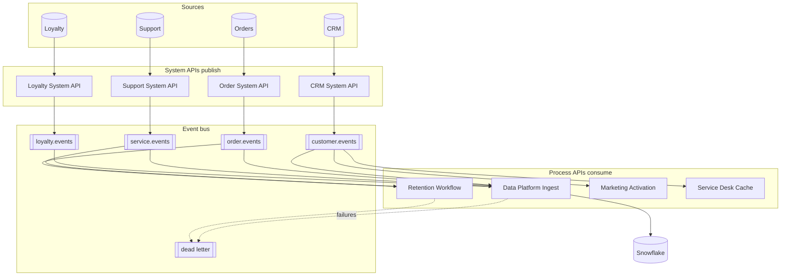
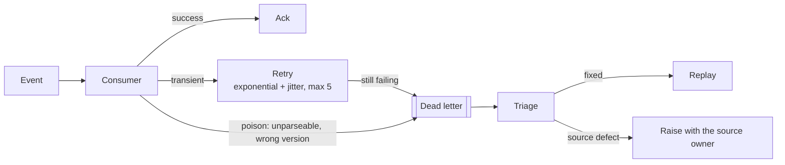
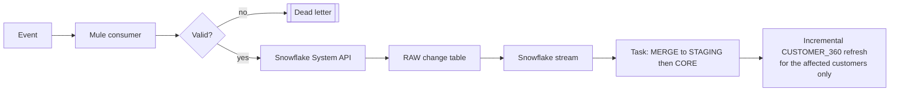

# Event-driven architecture

> **Status: designed, not implemented.** Nothing in this document runs. It is
> here because "we would add events later" is not an architecture, and because
> the decision *not* to build it yet is itself a decision worth defending,
> see [ADR-005](decisions/ADR-005-apis-versus-events.md).

## 1. What events would fix

The platform today is request/response with batch ingestion. That is the right
starting point, and it has two limits that events remove:

1. **Freshness.** `CUSTOMER_360` is rebuilt nightly. An agent looking at a
   customer who called yesterday sees yesterday's picture. For most fields that
   is fine; for "has an open case" and "placed an order this morning" it is not.
2. **Fan-out.** When a customer's marketing consent changes, four systems need to
   know. Today each one polls, or the CRM is modified to call four APIs, which
   couples the CRM to every consumer and makes adding a fifth a change to the CRM.

Events solve propagation. They do not solve request/response, and the mistake to
avoid is replacing a working synchronous read path with an eventually consistent
one because events are fashionable.

## 2. Event catalogue

| Event | Publisher | Trigger | Consumers | Ordering |
|---|---|---|---|---|
| `CustomerCreated` | CRM System API | A new customer record | Data platform, loyalty, marketing | Per customer |
| `CustomerUpdated` | CRM System API | Any tracked attribute changes | Data platform, marketing, service desk cache | **Per customer, strictly** |
| `ConsentChanged` | CRM System API | `MARKETING_OPT_IN` changes | Marketing (must act immediately), data platform | **Per customer, strictly** |
| `OrderCreated` | Order System API | Order accepted | Data platform, loyalty (accrual), fulfilment | Per order |
| `OrderCompleted` | Order System API | Fulfilment confirmed | Data platform, loyalty, churn re-scoring | Per order |
| `OrderReturned` | Order System API | Return processed | Data platform, loyalty (reversal), service | Per order |
| `SupportCaseCreated` | Support System API | Case opened | Data platform, churn re-scoring, service desk | Per case |
| `SupportCaseResolved` | Support System API | Case closed with CSAT | Data platform, churn re-scoring | Per case |
| `LoyaltyStatusChanged` | Loyalty System API | Tier changes | Data platform, marketing, service desk | Per customer |
| `ChurnRiskChanged` | Data platform | A customer crosses a band boundary | Retention workflow, service desk | Per customer |

`ConsentChanged` is the one with a hard latency requirement. Marketing acting on
stale consent is a regulatory problem, not a data freshness inconvenience: which
is why it is its own event rather than a flavour of `CustomerUpdated`.

`ChurnRiskChanged` is published by the platform and not consumed by it. It is
what turns a nightly score into a retention workflow trigger.

## 3. Envelope

```json
{
  "eventId": "evt-9f2c1a44-6d0f-4d0b-9b3f-1f2a0b7d4c11",
  "eventType": "OrderCompleted",
  "eventVersion": "1.0",
  "occurredAt": "2026-08-28T10:15:00.123Z",
  "publishedAt": "2026-08-28T10:15:00.456Z",
  "source": "acme.oms",
  "correlationId": "acme-6f1c9a2e-6d0f-4d0b-9b3f-1f2a0b7d4c11",
  "causationId": "evt-3a1b7c99-...",
  "partitionKey": "CRM-100005",
  "dataClassification": "INTERNAL",
  "data": {
    "orderId": "ORD-200026",
    "customerId": "CRM-100005",
    "orderDate": "2026-06-06",
    "netAmount": 199.75,
    "currencyCode": "USD"
  }
}
```

Design decisions in the envelope:

- **`correlationId` is the same id the synchronous path uses.** One trace across
  both paradigms, or the observability story has a hole in it exactly where the
  hard bugs live.
- **`causationId`** identifies the event that caused this one, which is how a
  cascade is untangled after the fact.
- **`occurredAt` and `publishedAt` are separate.** They differ, and the gap is a
  metric worth alerting on.
- **`partitionKey` is the customer business key** for every customer-scoped event,
  which is what gives per-customer ordering.
- **`dataClassification` travels with the event**, so a consumer's PII handling
  obligations arrive with the payload instead of being looked up.
- **Events carry a small, stable payload, not the whole entity.** A consumer that
  needs more calls the API. The alternative, fat events, makes every schema
  change a fan-out change.

## 4. Topology



**System APIs publish; process APIs consume.** The same layer boundary as the
synchronous path, deliberately: a source system's change format stops at the
system API, and the event carries canonical vocabulary. Otherwise the estate
learns the CRM's field names twice. Once through the API and once through the
bus, and the second time nobody notices until the CRM is replaced.

## 5. Bus selection

| Option | Fits when | Against |
|---|---|---|
| **Anypoint MQ** | Already MuleSoft; low operational burden; FIFO queues available | Lower throughput ceiling; weaker replay and stream processing |
| **Kafka / Confluent** | High volume; replay matters; other teams already use it | Real operational burden; a platform to run, not a service to consume |
| **Cloud-native (EventBridge, Pub/Sub)** | Already committed to one cloud | Ties the estate to that cloud |

**Recommendation: start with Anypoint MQ, design for Kafka.** The volumes that
justify Kafka (interaction events at 500 million a year) are in the *interaction*
domain, which is a batch-ingested analytical feed instead of an operational
event. The operational events here are thousands per day, not millions.

Designing for Kafka means: partition key in the envelope from day one, no
reliance on queue semantics Kafka lacks, and consumers written to be idempotent
so at-least-once delivery is safe. Those cost nothing now and are expensive to
retrofit.

## 6. Delivery guarantees

**At-least-once, with idempotent consumers.** Exactly-once across a bus and a
warehouse is a distributed transaction wearing a disguise; the honest version is
at-least-once plus deduplication at the consumer.

Deduplication is on `eventId`, held in the Anypoint object store with a TTL
comfortably longer than the maximum redelivery window.

**Ordering** is per partition key. Two `CustomerUpdated` events for the same
customer are ordered; two for different customers are not, and nothing needs
them to be. This is the guarantee that a single global ordering would buy at the
cost of all parallelism.

Where ordering cannot be guaranteed, a redelivery after a consumer failure: the
consumer uses `occurredAt` and the tracked-attribute hash to reject a stale
update instead of applying it. That is the same mechanism the SCD2 loader
already uses, which is not a coincidence: **an event consumer writing to an SCD2
table is the batch loader with a different trigger.**

## 7. Failure handling



A poison message must go to the dead-letter queue immediately instead of being
retried five times: it will fail identically each time, and while it does it
blocks its partition. That is how one malformed event stops an entire customer's
updates for an hour.

Dead-letter triage is a named operational duty with an SLA, not a queue somebody
looks at when they remember.

## 8. Schema evolution

Schemas registered in Exchange (or a schema registry), versioned semantically,
with **backward-compatible evolution only** within a major version:

- add optional fields. Safe;
- remove or rename a field, a new major version;
- change a type. A new major version.

Both versions publish in parallel during a migration window, consumers move at
their own pace, and usage per version is tracked so the old one can actually be
retired and not running forever.

## 9. What changes in the data platform



The batch path does not go away. Events update the fields that need freshness;
the nightly rebuild remains the reconciliation and the recovery path. Running
both is not duplication, it is the difference between a platform that can
recover and one that cannot.

Two fields would move to near-real-time first, because they are the ones an agent
notices: `OPEN_CASES` and `DAYS_SINCE_LAST_ORDER`.

## 10. When to use an API and when to use an event

| Use an API | Use an event |
|---|---|
| The caller needs an answer now | Nobody is waiting |
| The caller needs a specific record | Something happened that others may care about |
| The caller must know it succeeded | The publisher should not care who listens |
| Strong consistency is required | Eventual consistency is acceptable |
| Adding a consumer means a new client registration | Adding a consumer means a new subscription |
| Example: "show me this customer's 360" | Example: "this customer's consent changed" |

The failure mode in both directions:

- **Events used for request/response** produce a correlation-id chase every time
  someone asks a simple question, and a consumer that has to poll for its own
  reply.
- **APIs used for propagation** produce N callers polling, or a publisher
  hard-coded to call N consumers. Which is the point-to-point spaghetti this
  platform exists to remove.

## 11. What would have to be true before building this

1. The synchronous platform is in production and trusted. Adding an
   eventually-consistent path to a system nobody relies on yet doubles the
   operational surface before either half is proven.
2. A named consumer with a real freshness requirement. "Real-time" as an
   aspiration is not a requirement.
3. Dead-letter triage staffed. An event platform without it silently loses data,
   which is worse than not having one.
4. Idempotency and deduplication proven in the consumers, because at-least-once
   delivery is a promise the bus keeps and the consumer honours.
