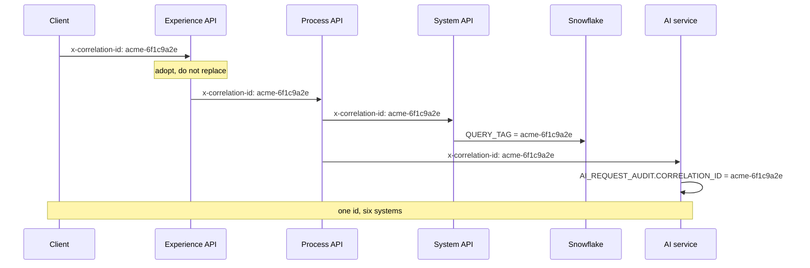
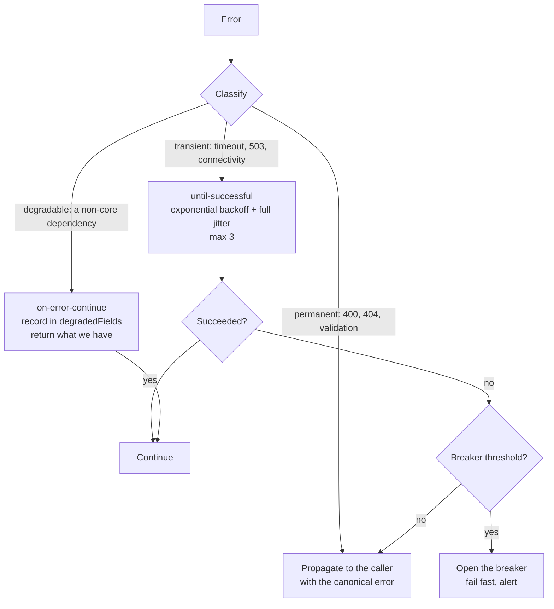

# Observability

## 1. The design goal

**One identifier, supplied by the caller or minted at the edge, must find every
artefact produced while handling a request**, the API call, the flow logs at
three layers, the warehouse query, the AI generation and its audit row.

Most platforms trace to the database boundary and stop. That is where the
interesting question starts: *why does the agent's screen show this number?*



## 2. Structured logging

Every log line, in every service and every Mule application, carries the same
core fields:

| Field | Always | Example |
|---|---|---|
| `timestamp` | yes | `2026-08-28T10:15:00.123Z` |
| `level` | yes | `INFO` |
| `service` | yes | `process-api` |
| `correlationId` | yes | `acme-6f1c9a2e-...` |
| `message` | yes | `customer_360_assembled` |
| `clientId` | at the edge | `acme-servicedesk-client` |
| `customerRef` | when relevant | the business key, **never** a name or e-mail |
| `dependency` | on an outbound call | `snowflake` |
| `durationMs` | on completion | `231.4` |
| `outcome` | on completion | `SUCCESS` / `DEGRADED` / `ERROR` |

Rules:

- **`logPayloads: false` in every environment, including development.** A
  customer API logging payloads is a PII incident waiting for a bad day, and the
  habit is what matters.
- Log at **flow boundaries**, not at every step. A log line per processor
  produces volume, cost and no information.
- **Message names are event names**, not sentences: `customer_360_assembled`,
  `degraded_field`, `ai_insight_served`. They are what a dashboard groups by.

## 3. The three questions, and the query that answers each

### "Why was this request slow?"

```sql
-- Anypoint Monitoring / log analytics
SELECT service, message, durationMs, dependency, outcome
FROM   platform_logs
WHERE  correlationId = 'acme-6f1c9a2e-...'
ORDER  BY timestamp;
```

Each layer emits its own duration, so the hop that spent the time is immediate.

### "What did the warehouse actually run?"

```sql
SELECT QUERY_TEXT, TOTAL_ELAPSED_TIME, BYTES_SCANNED,
       CREDITS_USED_CLOUD_SERVICES, WAREHOUSE_NAME, ERROR_MESSAGE
FROM   SNOWFLAKE.ACCOUNT_USAGE.QUERY_HISTORY
WHERE  QUERY_TAG = 'acme-6f1c9a2e-...';
```

`QUERY_TAG` is set on every statement by the Snowflake System API. This is the
join that most implementations lack, and it turns "the API was slow" into "the
query scanned 40 GB because the predicate did not prune".

### "What did the model say, and what was it told?"

```sql
SELECT a.CAPABILITY, a.MODEL_NAME, a.INPUT_TOKENS, a.OUTPUT_TOKENS,
       a.ESTIMATED_COST_USD, a.LATENCY_MS, a.OUTCOME, a.BLOCK_REASON,
       i.GENERATED_TEXT, i.CONFIDENCE_SCORE, i.REVIEW_STATUS,
       i.GROUNDING_SNAPSHOT           -- exactly what the model was given
FROM   ACME_EDP.AI.AI_REQUEST_AUDIT a
LEFT   JOIN ACME_EDP.AI.AI_CUSTOMER_INSIGHTS i
       ON i._CORRELATION_ID = a.CORRELATION_ID
WHERE  a.CORRELATION_ID = 'acme-6f1c9a2e-...';
```

## 4. Metrics

### Technical

| Metric | Source | Alert |
|---|---|---|
| Request rate, per API and per client | Anypoint Monitoring | Anomaly vs the 7-day baseline |
| Latency p50 / p95 / p99 | Anypoint Monitoring | p95 > 800 ms for 5 minutes |
| Error rate by `errorCode` | Log aggregation | > 1% of requests over 5 minutes |
| Degraded response rate | `meta.partial` | > 5% over 15 minutes |
| Circuit breaker state | `/health` on each layer | Any breaker OPEN |
| Worker CPU and heap | Runtime Manager | > 80% for 10 minutes |
| Warehouse queue depth | `QUERY_HISTORY` | Queued time > 2 s |
| Credits consumed, per warehouse | `WAREHOUSE_METERING_HISTORY` | > 120% of the 7-day mean |

### Data

| Metric | Source | Alert |
|---|---|---|
| Pipeline duration and row counts | `GOVERNANCE.PIPELINE_RUN_LOG` | Duration > 2× the 7-day mean |
| `CUSTOMER_360` freshness | `AS_OF_TIMESTAMP` | Older than 24 hours (`DQ-X-007`) |
| DQ failures by severity | `GOVERNANCE.V_DQ_LATEST` | Any BLOCKING failure |
| Quarantined row count | `RAW_REJECTED_RECORDS` | > 0.5% of a batch |
| Row-count drift per source | `PIPELINE_RUN_LOG` | ±20% vs the 7-day mean |

Row-count drift catches the failure nothing else does: a source that silently
starts sending a partial extract. Every individual row passes every rule.

### AI

| Metric | Source | Alert |
|---|---|---|
| Generative calls, per client | `AI_REQUEST_AUDIT` | > 150% of the 7-day mean |
| Estimated cost per day | `AI_REQUEST_AUDIT` | > 80% of the monthly budget pace |
| Guardrail block rate | `OUTCOME = 'BLOCKED'` | > 2% over an hour |
| Mean groundedness | `AI_EVALUATION_RESULT` | Below the threshold on any day |
| Review queue depth and age | `REVIEW_STATUS = 'PENDING_REVIEW'` | Depth > 50, or oldest > 48 hours |
| Cache hit rate | `cached` flag | Sudden drop, usually a TTL or key bug |

The review queue alert is a governance control. **A queue nobody reads is worse
than no queue**, because it manufactures the appearance of oversight.

### Business

| Metric | Why an integration platform publishes it |
|---|---|
| Customer 360 requests per day, per consumer | Shows who actually depends on the platform, which is what a deprecation conversation needs |
| High/critical churn cohort size | The number the retention programme is measured on |
| Insights generated vs acted on | Whether the AI capability is used or merely available |
| Recommended action distribution | A sudden skew usually means a data problem, not a behaviour change |

## 5. Distributed tracing

OpenTelemetry, with the correlation id as the trace id so a log search and a
trace search find the same thing.

| Span | Attributes |
|---|---|
| `experience.customer360` | `client_id`, `customer_ref`, `masked`, `partial` |
| `process.assemble360` | `degraded_fields`, `include_ai` |
| `system.snowflake.query` | `statement_name`, `rows`, `warehouse` |
| `snowflake.execute` | `query_id`, `bytes_scanned`, `credits` |
| `ai.generate` | `capability`, `provider`, `model`, `tokens_in`, `tokens_out`, `confidence`, `review_status` |

Attribute rules: **no PII, ever**. `customer_ref` is the business key, never a
name. Traces are exported and searchable far more widely than logs.

## 6. Health checks

Every service exposes `/health` returning its status **and its circuit-breaker
state**:

```json
{
  "status": "UP",
  "service": "process-api",
  "circuitBreakers": [
    {"dependency": "system-api", "state": "CLOSED", "failures": 0},
    {"dependency": "ai-service", "state": "HALF_OPEN", "failures": 5}
  ]
}
```

A health check that reports UP while every dependency is failing is worse than
none, because it silences the alert that would have told you.

Liveness and readiness are distinguished: liveness is "the process is running";
readiness is "it can serve traffic", which for the System API means it can reach
the warehouse.

## 7. Error handling and dead letters



**Full jitter on the backoff, not a fixed schedule.** Without it, every worker
retries at the same moment and the recovering downstream is knocked over by the
synchronised wave.

Dead-letter handling, by class:

| Class | Destination | Reprocessing |
|---|---|---|
| Failed data rows | `RAW.RAW_REJECTED_RECORDS` | Re-run the load after the source is fixed |
| Failed async messages (event-driven, designed) | Anypoint MQ dead-letter queue | Replay after triage |
| Failed AI generations | `AI_REQUEST_AUDIT` with `OUTCOME = 'ERROR'` | Regenerate on demand; never auto-retried |

## 8. Dashboards

| Dashboard | Audience | Panels |
|---|---|---|
| Platform health | On-call | Request rate, latency percentiles, error rate by code, breaker states, worker health |
| Data pipeline | Data engineering | Run durations, row counts, DQ scorecard, freshness, quarantine volume |
| AI operations | AI owner, finance | Calls and cost by client, guardrail blocks, evaluation trend, review queue depth and age |
| Consumer view | API product owner | Usage by client, latency by client, error rate by client, deprecation migration progress |

The consumer view is the one people forget. It is what turns "we should retire
v1" into a conversation with the three teams that still call it.

## 9. Alert routing

| Severity | Examples | Route | Response |
|---|---|---|---|
| P1 | Experience API down; any BLOCKING DQ failure in production; warehouse unreachable | Page | 15 minutes |
| P2 | p95 breached for 15 minutes; a circuit breaker open; AI spend above pace | On-call queue | 1 hour |
| P3 | WARNING DQ above threshold; review queue depth | Ticket to the steward | 3 business days |
| P4 | Trend deviations | Weekly review |: |

## 10. What is instrumented locally

Local mode produces the same structured JSON logs with the same field contract,
so a log query written against a laptop works against production. What is absent:
Anypoint Monitoring, an OTLP collector, `ACCOUNT_USAGE` (there is no Snowflake),
and alert routing. The correlation-id propagation is real and is asserted by
`tests/integration/test_end_to_end.py`.
