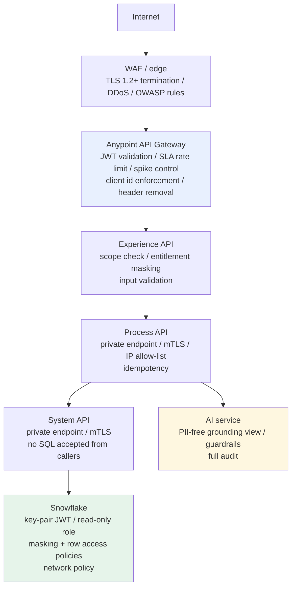
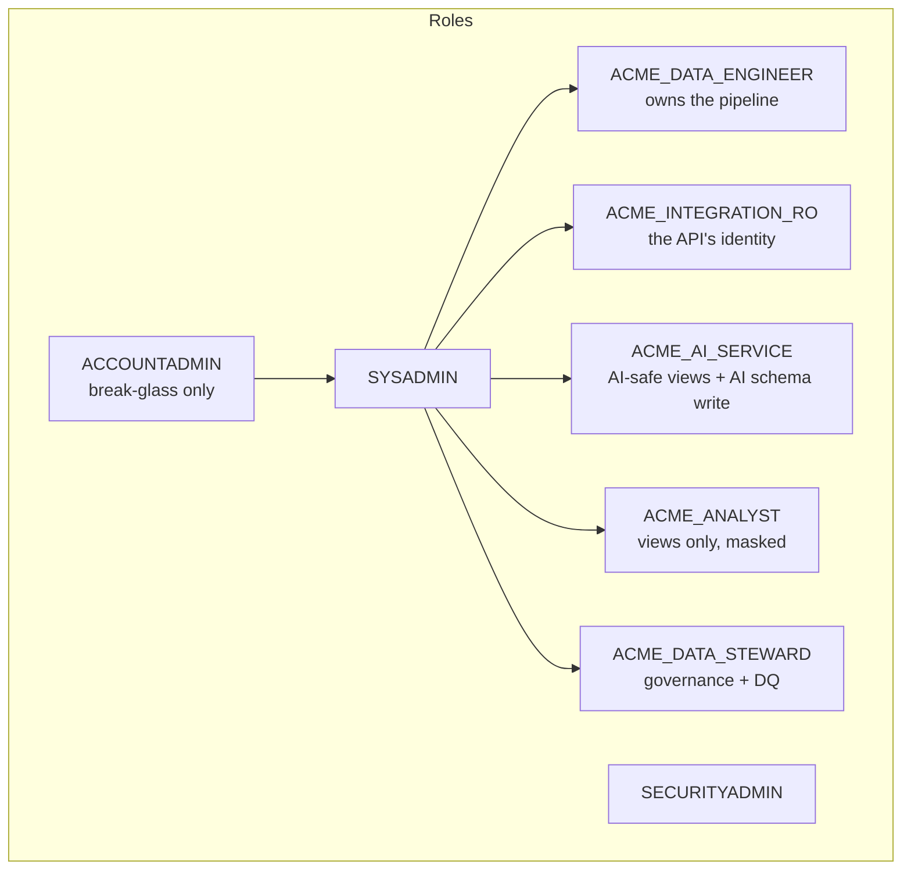

# Security architecture

> How security would be implemented in production. What is running locally is a
> faithful behavioural model of it: the mock authorisation server and the
> in-code policy middleware exist so the behaviour is testable, not because an
> application should ever issue its own tokens.

## 1. Threat model

Designing controls without naming the threats produces a checklist. These are
the six that drive every decision below.

| # | Threat | Realistic actor | Primary control | Backstop |
|---|---|---|---|---|
| T1 | Bulk exfiltration of customer PII through an API | Compromised client credential | Least-privilege scopes; masking by default; rate limits | Per-client audit; anomaly alert on volume |
| T2 | Arbitrary SQL reaching the warehouse | Compromised process API, or a flaw in it | The System API accepts **no** SQL: only resources | Read-only Snowflake role |
| T3 | Prompt injection through customer-supplied text | A customer typing into a support web form | Input sanitisation and neutralisation | Output guardrails; forced human review |
| T4 | Credential leakage into logs, repos or tickets | Ordinary human error | No secrets in the repository; key-pair auth with no password | Secret scanning in CI; short token lifetimes |
| T5 | Excess generative spend, accidental or malicious | A retry storm, or a misconfigured client | Spike control; idempotency; opt-in generation | Snowflake resource monitor with a hard stop |
| T6 | Privilege creep over time | Well-meaning "just give it access" | Roles grant to roles, never to users; entitlement per client application | Quarterly access review against `DATA_DICTIONARY` |

## 2. Defence in depth

Each layer assumes the one outside it may have failed. That is why the System
API refuses mutating SQL even though its Snowflake role could not execute it,
and why the warehouse role is read-only even though nothing upstream can issue a
write. Either control alone is a single point of failure.

## 3. Authentication and authorisation

### Client authentication

OAuth 2.0 **client credentials**, and nothing else. There is no
authorization-code flow because every consumer of this platform is a system;
end-user identity lives in the calling application's own session. Adding a user
flow here would mean the platform re-implementing an identity system it does not
own.

| Environment | Token issuer | Signature | Lifetime |
|---|---|---|---|
| Production / UAT | Anypoint Access Management or the enterprise IdP | RS256, validated against a rotating JWKS | 60 minutes |
| Local | Mock server in the experience layer | HS256, local key | 60 minutes |

RS256 with JWKS and not a shared HMAC secret: a shared secret has to be
distributed to every validating application, which makes rotation a coordinated
outage. With JWKS, rotation is a publish.

Validation is an **API Manager policy** (`mule/common/policies/jwt-validation.json`),
not application code. A policy applied in code ships with the release and can be
removed by a developer; a policy at the gateway is owned by the platform team, is
auditable, and applies to every version of the API instance.

### Scopes, least privilege

| Scope | Grants | Held by |
|---|---|---|
| `customer:read` | Customer 360 profile and orders | All client applications |
| `insights:read` | Derived analytics and churn scores | Service desk, marketing, BI |
| `ai:invoke` | Trigger a generative call (chargeable, audited) | Service desk, BI |
| `ai:write` | Persist generated content and audit rows | **The AI service only** |
| `pii:read` | Receive unmasked direct identifiers | **The service-desk application only** |
| `admin:write` | Administrative operations | No client application |

Registered clients and what they may do:

| Client | Scopes | SLA tier | Notes |
|---|---|---|---|
| `acme-servicedesk-client` | customer, insights, ai:invoke, **pii:read** | gold | Agents speak to customers and must be able to read back an e-mail address |
| `acme-portal-client` | customer, insights, ai:invoke | gold | Self-service portal; sees masked identifiers |
| `acme-batch-client` | customer, insights | silver | Nightly extracts; no generative access |
| `acme-readonly-client` | customer | bronze | Reporting; the minimum that is useful |
| `acme-ai-service` | customer, insights, ai:invoke, **ai:write** | internal | Platform component; holds no `pii:read` |

Entitlement is granted **per client application, not per endpoint**. That is what
makes an access review possible: the question "who can see unmasked e-mail
addresses?" has a one-row answer.

### The caller's token is not forwarded

The experience layer makes the entitlement decision and then calls downstream
with the *platform's* credential. Forwarding a client token inward would mean
every internal API re-implementing the same decision, differently, and would
make a compromised client credential valid three layers deep.

## 4. Transport security

| Hop | Protocol | Authentication |
|---|---|---|
| Client → gateway | TLS 1.2+, pinned cipher suites | OAuth bearer token |
| Gateway → experience | mTLS inside the VPC | Client certificate |
| Experience → process | mTLS, private endpoint | Client credentials + certificate |
| Process → system | mTLS, private endpoint, IP allow-list | Client credentials + certificate |
| System → Snowflake | TLS 1.2+ | **Key-pair JWT**: no password exists |
| System → source systems | TLS 1.2+ (mTLS where the source supports it) | Per-source credential from the vault |
| Process → AI provider | TLS 1.2+ | API key from the vault, or Cortex inside the account |

Ciphers are pinned in `mule/common/global-config.xml` rather than left to the
JVM default, so a runtime upgrade cannot silently re-enable a weak suite.

Process and System APIs have **no public endpoint at all**. The IP allow-list is
the second control after network segmentation, not the first.

## 5. Secrets

The rule: **the repository contains the *name* of every secret and the *value*
of none.**

| Secret | Where it lives | Rotation |
|---|---|---|
| Snowflake private key | Anypoint Secrets Manager, injected at deploy | 90 days, with an overlap window so rotation is not an outage |
| OAuth client secrets | The IdP; never in a file | 180 days |
| Mule secure-properties key | Runtime Manager secure property, `-M-Dsecure.key` | 180 days |
| Source system credentials | Vault, referenced as `${secure::...}` | Per source policy |
| AI provider API key | Vault; absent entirely when Cortex is used | 90 days |

Mechanics:

- Non-sensitive settings live in `config/<env>.yaml`, committed.
- Sensitive values live in `config/<env>-secure.yaml`, encrypted with AES/CBC,
  **not** committed. A `.example` template *is* committed so that a missing
  property fails code review instead of a 3 a.m. deployment.
- The decryption key is supplied at runtime and never appears in the pom, in
  git, or in a pipeline variable that is echoed to a log.
- CI runs gitleaks plus a repository-wide pattern check for credentials, private
  keys, AWS key ids and hard-coded Snowflake hosts. It fails the build.

**Snowflake key-pair instead of a password**, specifically: there is no shared
secret that can be pasted into a support ticket, rotation is a key swap rather
than a coordinated password change, and the resulting token lives for minutes
rather than "until someone notices".

## 6. PII handling

Classification lives in `GOVERNANCE.DATA_DICTIONARY`; the full table is in
[data-governance.md](data-governance.md).

| Class | Examples | At rest | In transit | To a client | To a model |
|---|---|---|---|---|---|
| RESTRICTED | e-mail, phone, date of birth, free-text case description | Encrypted; masking policy | TLS | Masked unless `pii:read` | **Never** |
| CONFIDENTIAL | Name, consent flag, generated insight | Encrypted; masking policy | TLS | Masked unless `pii:read` | Never |
| INTERNAL | Segment, order value, scores | Encrypted | TLS | Yes | Yes |
| PUBLIC | Product catalogue | Encrypted | TLS | Yes | Yes |

Three distinct mechanisms, deliberately not conflated:

1. **Masking**, presentation-level, irreversible, applied at the experience
   layer from the token. Rules: e-mail keeps the first character and the domain;
   phone keeps the last four digits; the given name is kept and the family name
   masked; date of birth is generalised to the year.

   Keeping the given name is a deliberate compromise. Masking that makes the
   record unusable to an agent is masking that gets switched off in production.

2. **Column masking policies in Snowflake**: enforced in the warehouse for
   analysts, so an analyst querying directly sees the same masked values as an
   API consumer without `pii:read`. Two enforcement points, one policy.

3. **Redaction before the trust boundary**, direct identifiers are stripped
   from any free text before it leaves the platform towards a model provider,
   and the AI-safe view contains no identifiers at all.

Date of birth is treated as a **quasi-identifier**: with a postcode it
re-identifies most people, so it is generalised instead of left whole.

## 7. Snowflake security

| Role | Can | Cannot |
|---|---|---|
| `ACME_INTEGRATION_RO` | `SELECT` on `ANALYTICS` and `AI` **views** | Read `RAW`, `STAGING` or any base table; write anything |
| `ACME_AI_SERVICE` | `SELECT` on the AI-safe views; `INSERT` into three `AI` tables | See any direct identifier; run arbitrary DDL |
| `ACME_ANALYST` | `SELECT` on `CORE` and `ANALYTICS` views, with masking applied | Read `RAW`; see unmasked PII without `pii:read` entitlement |
| `ACME_DATA_ENGINEER` | Own and rebuild every layer | Grant roles; alter security policies |
| `ACME_DATA_STEWARD` | Read everything unmasked (for stewardship); manage DQ rules | Alter data |

Additional controls in `snowflake/10-security/`:

- **Network policy**, the account accepts connections only from the CloudHub
  VPC egress range and the corporate VPN.
- **Dynamic data masking** on every column the dictionary marks as PII, keyed on
  the executing role.
- **Row access policy** on `CUSTOMER_360` for regional segregation, so an EU
  analyst does not see US customers and vice versa.
- **`ACCESS_HISTORY`** retained and reconciled against declared lineage.
- **Resource monitors**: the AI warehouse has a hard suspend at 100% of quota,
  which is a security control as much as a cost one: it caps the damage from a
  runaway or hostile generative loop.

## 8. AI-specific controls

Covered fully in [ai-architecture.md](ai-architecture.md) §6; the security-relevant
summary:

| Control | Implementation |
|---|---|
| The model never reads a source system | It reads `AI.V_CUSTOMER_AI_CONTEXT` only |
| The model never receives a direct identifier | They are absent from that view by construction, not filtered |
| Prompt injection through customer text | Detected, neutralised, and forces human review |
| Fabricated figures | Every number in the output must be traceable to the grounding block |
| Commitments made on Acme's behalf | Blocked by an output guardrail |
| Actions outside policy | A closed approved-action list; anything else is suppressed |
| Cost and attribution | Every call audited with client id, tokens and estimated cost |
| Generated content as a system of record | It is never one, and is never fed back as model input without human approval |

## 9. API policies

Configured in API Manager, exported to `mule/common/policies/`:

| Policy | Applied to | Purpose |
|---|---|---|
| JWT validation | Experience APIs | Signature, issuer, audience, expiry, scopes |
| Rate limiting (SLA) | Experience APIs | Per-client tiers; the noisiest consumer cannot degrade everyone else |
| Spike control | AI Insights API | Generative calls are the one endpoint class where a spike converts directly into money |
| Client id enforcement | All | Every call attributable to a registered application |
| IP allow-list | Process and System APIs | Makes "internal only" enforceable rather than aspirational |
| Header removal | Experience APIs | Strips `x-query-tag`, `x-mule-*`, `server`, internal routing information helps an attacker and nobody else |

## 10. Audit

| What | Where | Retention |
|---|---|---|
| Every API call | Anypoint Monitoring + the platform log stream | 90 days hot, 13 months cold |
| Every warehouse query | `SNOWFLAKE.ACCOUNT_USAGE.QUERY_HISTORY`, tagged with the correlation id | 365 days |
| Every generative call, successful or not | `AI.AI_REQUEST_AUDIT` | 24 months |
| Every generated insight and its grounding snapshot | `AI.AI_CUSTOMER_INSIGHTS` | 24 months |
| Every quarantined record and why | `RAW.RAW_REJECTED_RECORDS` | 90 days |
| Consent state over time | `CORE.V_MARKETING_CONSENT_HISTORY` | 7 years |

The AI audit records **blocks and errors as well as successes**. An audit trail
that only records successes cannot answer the two questions asked after an
incident: what did we refuse, and what did we spend.

## 11. Regulatory posture

Not legal advice; these are the design accommodations made.

| Requirement | How the design accommodates it |
|---|---|
| Right of access | `CUSTOMER_BK` reaches every table; one query assembles a subject's data |
| Right to erasure | Profile and contact data deleted; transactional records pseudonymised and retained 7 years for financial reporting |
| Consent | Historised in `CORE.CUSTOMER`; the consent state at any past date is evidence |
| Purpose limitation | Domain ownership and scope-based entitlement; marketing cannot read the support case narrative |
| Data minimisation | The AI-safe view carries only what the capability needs |
| Automated decision-making | No automated decision affects a customer. `NEXT_BEST_ACTION` always requires human approval |
| Breach notification | Correlation-id tracing plus per-client audit makes the blast radius answerable in hours |
| Cross-border transfer | Regional row access policy; Cortex keeps inference inside the account and the region |

## 12. What is *not* secured in this proof of concept

- The local mock authorisation server signs with HS256 and a key in
  `.env.example`. It exists to make the flow testable and would be a critical
  finding in any real deployment.
- The local services run HTTP, not HTTPS. The Mule configuration specifies HTTPS
  with a TLS context everywhere.
- No penetration test, no threat-model review by a security function, no
  compliance attestation has been performed.
- The masking, row access and network policies in `snowflake/10-security/` are
  written and reviewable but have never been applied to a real account.
